# Activity Diagrams

## OneOrder (Customer App)

### 1. Login/Register
User enters the app. If not logged in, they are prompted to login or register.

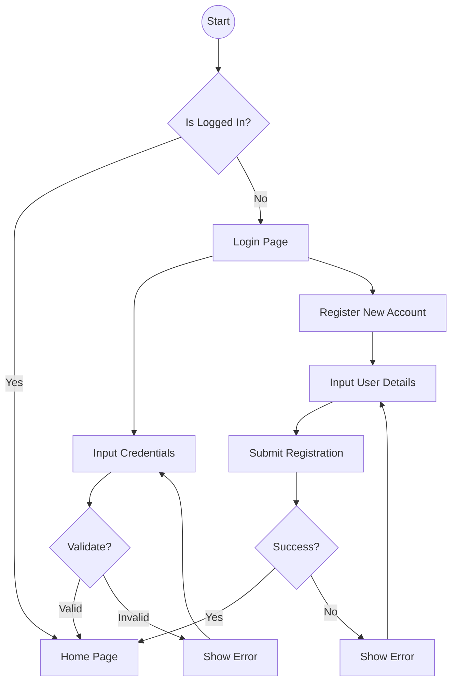

### 2. Home/Menu Browsing
User scans a QR code (simulated or real) to identify table, then browses the menu.

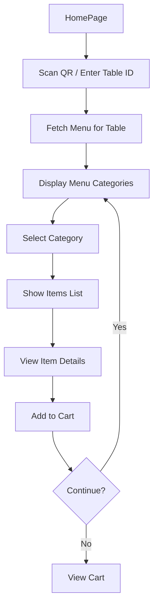

### 3. Cart/Order Placement
User reviews cart and places order.

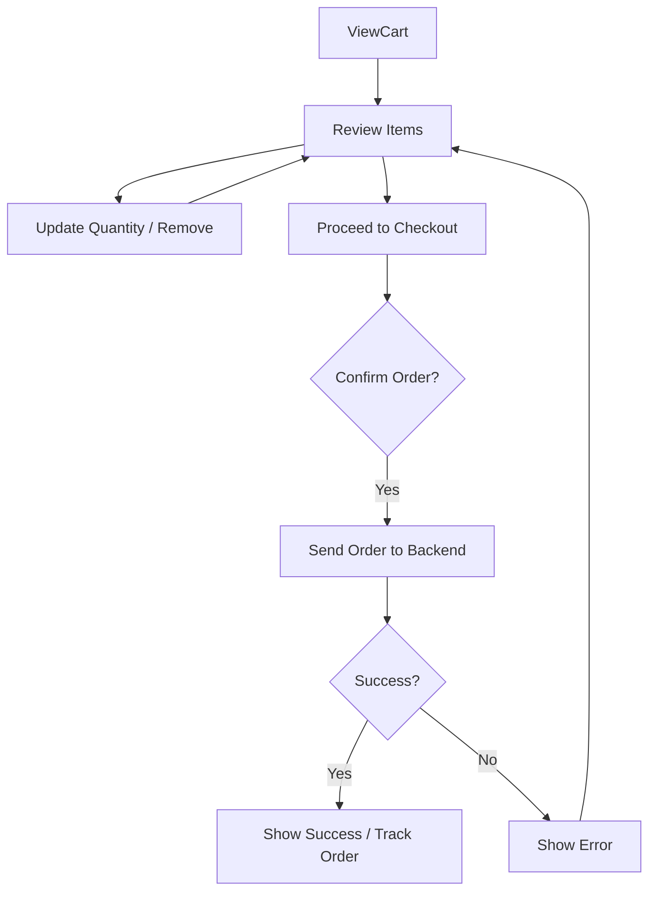

### 4. Order History/Tracking
User tracks the status of their active order.

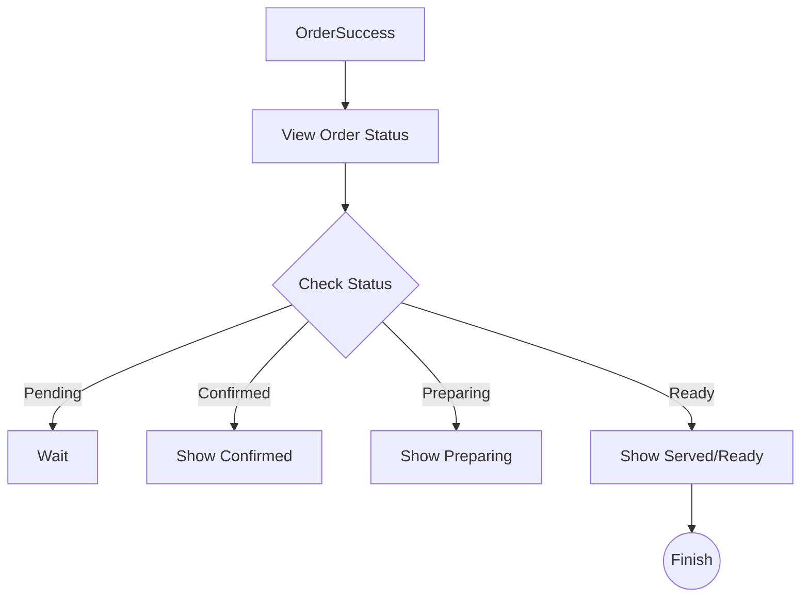

### 5. Profile Management
User views and updates their profile.

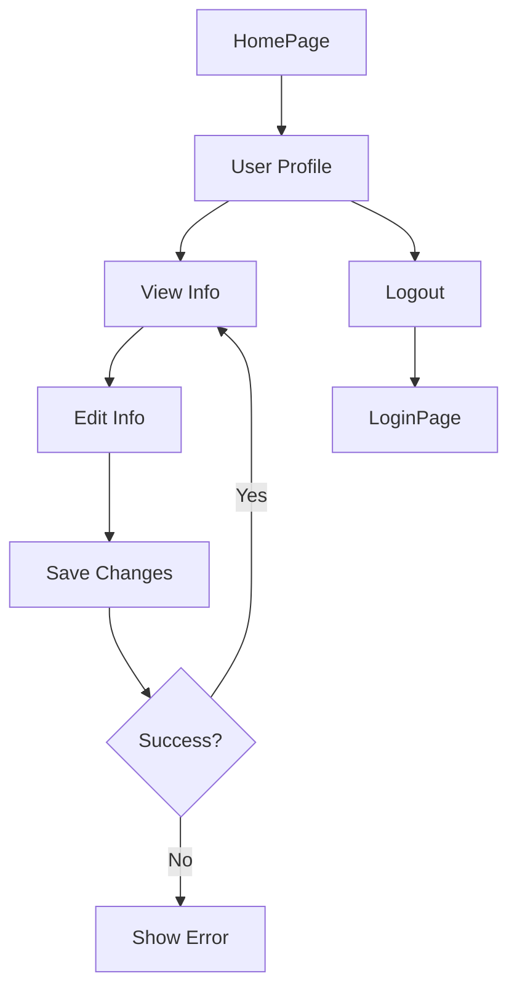

---

## OneOrder_SM (Staff/Manager App)

### 1. Login
Staff logs in with credentials.

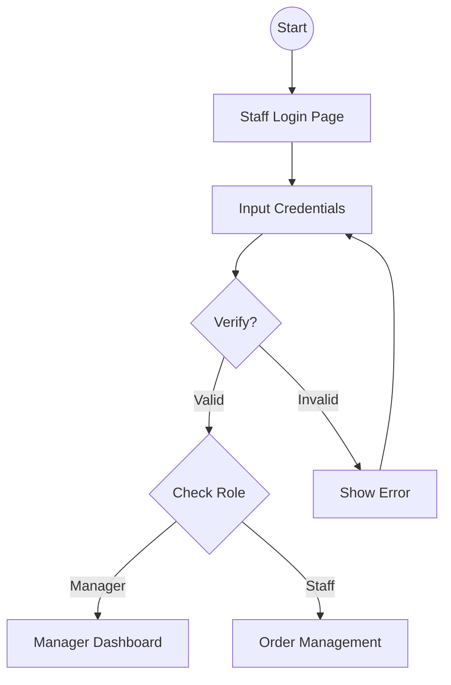

### 2. Dashboard/Stats (Manager)
Manager views usage statistics.

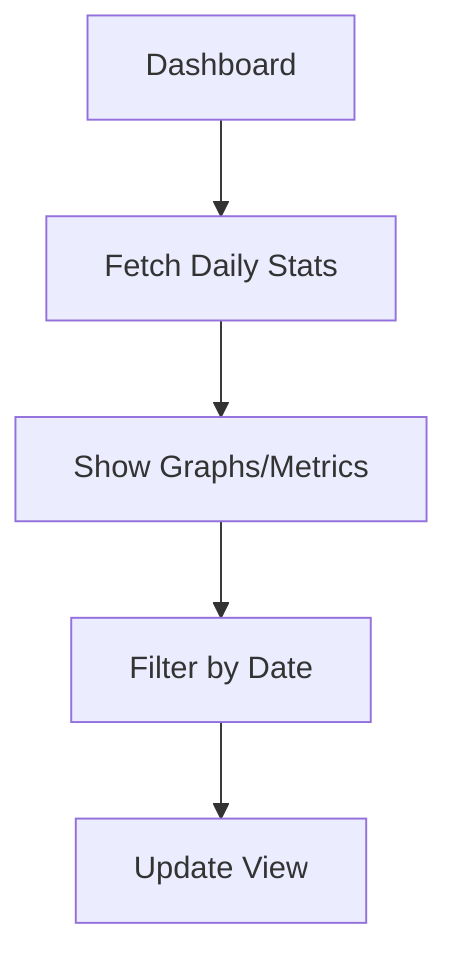

### 3. Order Management
Staff views and updates order status.

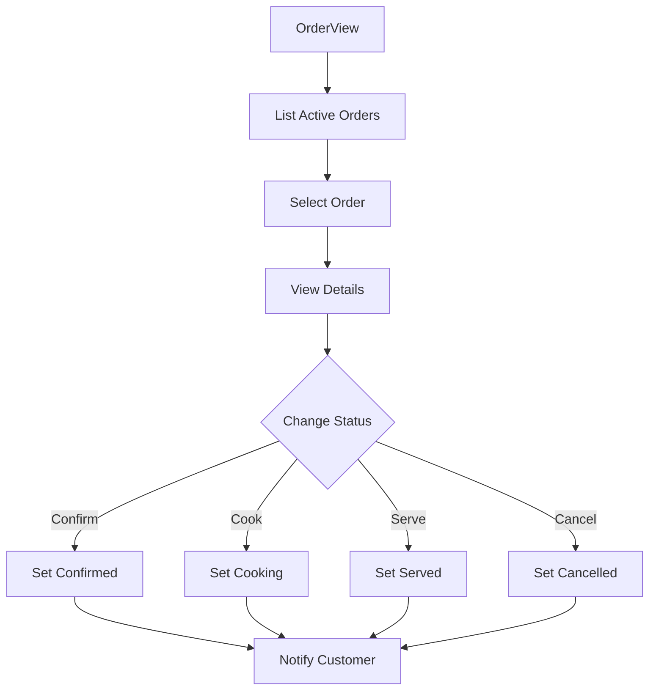

### 4. Table Management
Staff manages table availability.

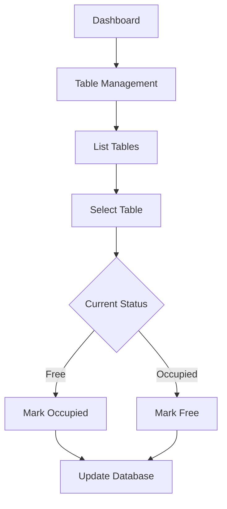

### 5. Menu Management (Manager)
Manager adds/edits menu items.

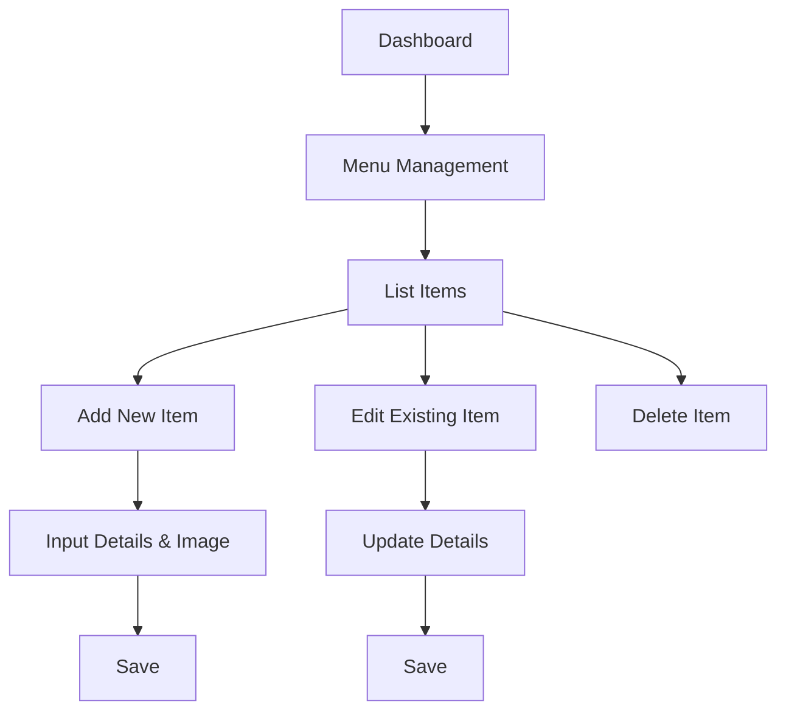

### 6. Staff Management (Manager)
Manager adds/removes staff.

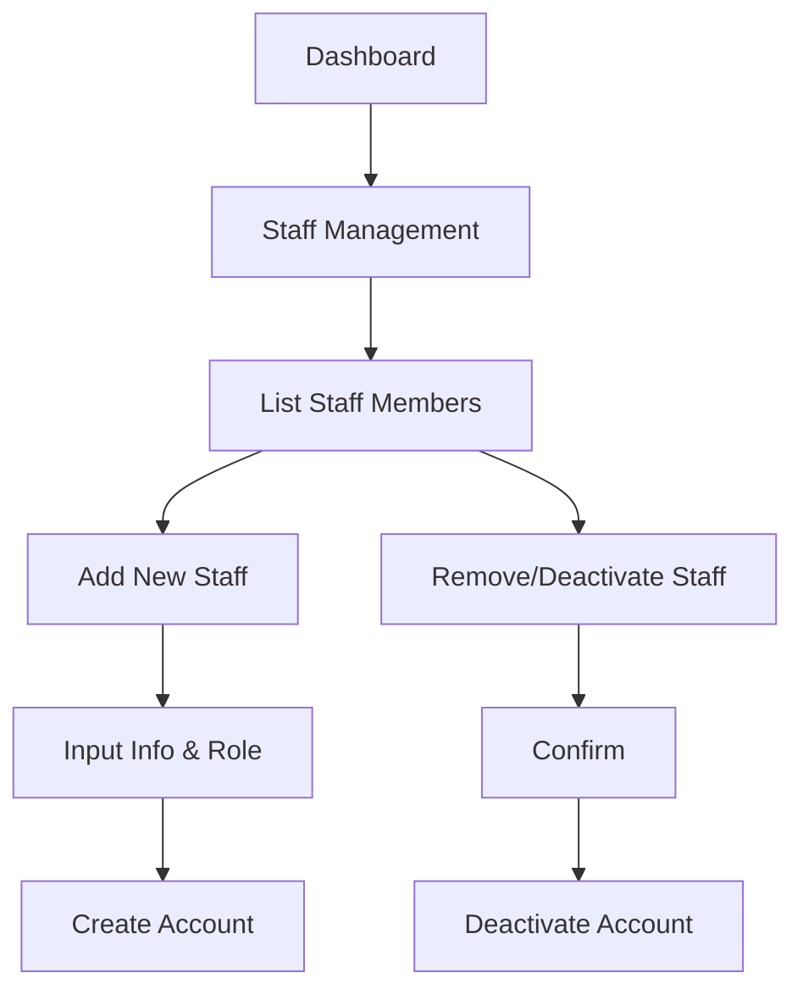
