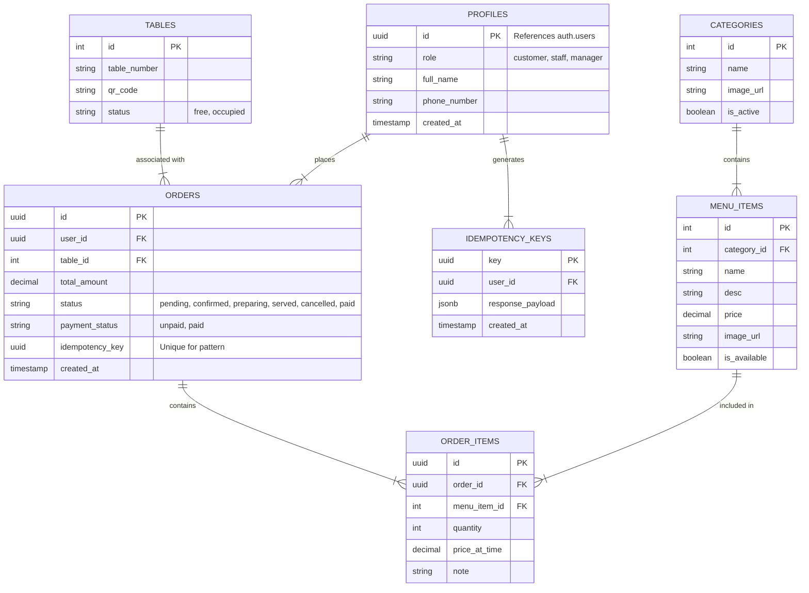

# Database Design: OneOrder System

## System Overview
The system uses **Supabase (PostgreSQL)** as the backend. It serves two applications:
1.  **OneOrder**: Customer facing (Menu, Cart, Orders).
2.  **OneOrder_SM**: Staff/Manager facing (Order Mgmt, Menu Mgmt, Stats).

## ER Diagram

## Table Descriptions

### Authentication & Profiles
- **profiles**: Extends the default Supabase `auth.users` table. Stores application-specific user data like role (`manager`, `staff`, `customer`).

### Menu System
- **categories**: Groups menu items (e.g., "Drinks", "Main Course").
- **menu_items**: The actual food/drink items. Linked to categories.

### Restaurant Operations
- **tables**: Physical tables in the restaurant. Contains status to help staff manage occupancy.

### Ordering System
- **orders**: The core transaction table.
    - `status`: Tracks the lifecycle (Pending -> ... -> Served).
    - `idempotency_key`: Used to prevent duplicate orders.
- **order_items**: The line items for each order (snapshots price at time of order).

### Reliability
- **idempotency_keys**: Stores keys and responses to handle network retries gracefully.
