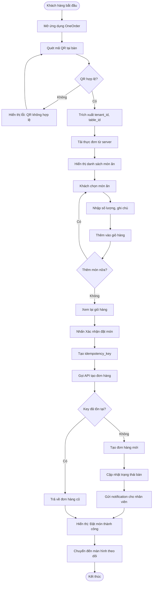
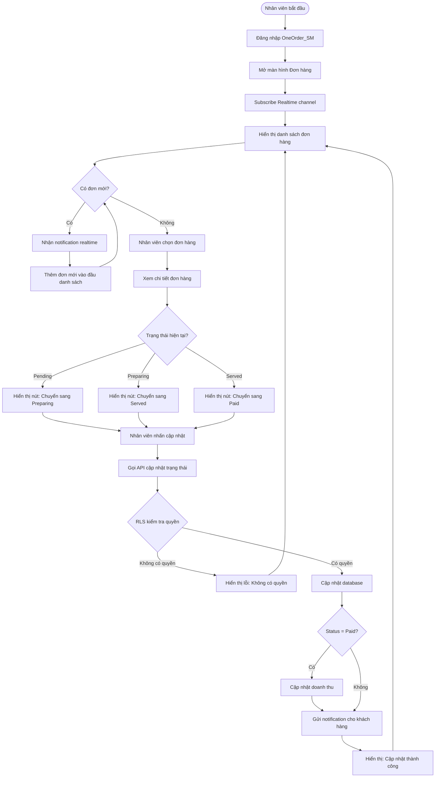
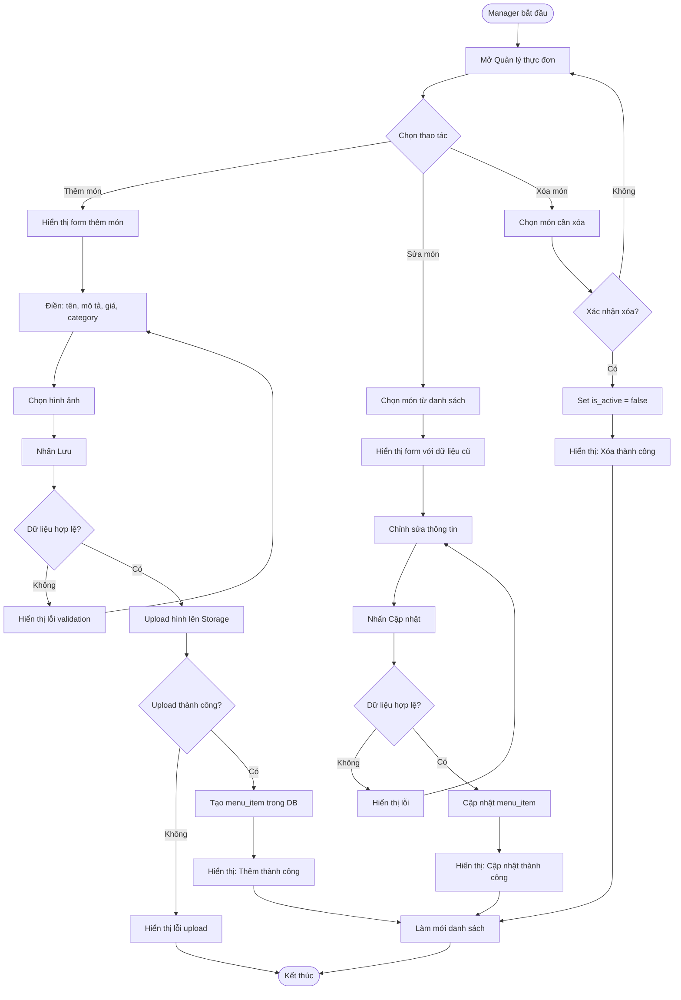

# CHƯƠNG 2. PHÂN TÍCH YÊU CẦU

Trong Chương 2 này, báo cáo sẽ tập trung vào khía cạnh phân tích các yêu cầu của Hệ thống Quản lý Nhà hàng và Gọi món theo mô hình Multi-tenant OneOrder, bắt đầu từ việc làm rõ bài toán, đối tượng sử dụng từ đó đưa ra các yêu cầu chức năng và phi chức năng của hệ thống cho cả hai ứng dụng: OneOrder (khách hàng) và OneOrder_SM (nhân viên/quản lý).

## 2.1. Xác định bài toán và đối tượng sử dụng

### 2.1.1. Bài toán nghiệp vụ

Bài toán được đặt ra là cần xây dựng một hệ thống quản lý nhà hàng toàn diện theo mô hình Multi-tenant, cho phép nhiều nhà hàng khác nhau đăng ký và sử dụng chung một nền tảng công nghệ. Hệ thống cần giải quyết các vấn đề sau:

**Đối với khách hàng:** Hiện nay, quy trình đặt món truyền thống tại nhà hàng thường gặp nhiều bất cập. Khách hàng phải chờ nhân viên đến ghi nhận đơn hàng, dễ xảy ra sai sót trong quá trình truyền đạt thông tin, đặc biệt với các món ăn có tên phức tạp hoặc yêu cầu đặc biệt. Thời gian chờ đợi kéo dài, đặc biệt trong giờ cao điểm, ảnh hưởng đến trải nghiệm dùng bữa. Khách hàng cũng không có cách nào để theo dõi trạng thái đơn hàng của mình (đang chuẩn bị, đã phục vụ, v.v.).

**Đối với nhân viên nhà hàng:** Nhân viên phải ghi nhận đơn hàng thủ công, chạy qua lại giữa bàn khách và quầy bar/bếp để truyền đạt thông tin. Việc quản lý nhiều bàn cùng lúc trong giờ cao điểm rất khó khăn, dễ nhầm lẫn và quên đơn hàng. Không có công cụ để theo dõi tổng quan tất cả các đơn hàng đang xử lý.

**Đối với quản lý nhà hàng:** Việc quản lý thực đơn, cập nhật giá cả, thêm/xóa món ăn thủ công rất tốn thời gian. Khó khăn trong việc quản lý nhân viên, phân quyền truy cập hệ thống. Thiếu các báo cáo thống kê tự động về doanh thu, món ăn bán chạy, hiệu suất phục vụ. Đối với chuỗi nhà hàng, việc quản lý tập trung nhiều chi nhánh trở nên phức tạp với dữ liệu phân tán.

### 2.1.2. Đối tượng sử dụng hệ thống

Hệ thống OneOrder phục vụ ba nhóm đối tượng chính với các nhu cầu khác nhau:

**Khách hàng (Customer):** Là người đến nhà hàng để dùng bữa. Họ sử dụng ứng dụng OneOrder trên điện thoại cá nhân để quét mã QR tại bàn, xem thực đơn với hình ảnh và mô tả chi tiết, tự đặt món mà không cần gọi nhân viên, và theo dõi trạng thái đơn hàng theo thời gian thực.

**Nhân viên nhà hàng (Staff):** Bao gồm nhân viên phục vụ, thu ngân, và nhân viên bếp. Họ sử dụng ứng dụng OneOrder_SM để nhận thông báo đơn hàng mới theo thời gian thực, xem danh sách tất cả các đơn hàng đang xử lý, cập nhật trạng thái đơn hàng (đang chuẩn bị → đã phục vụ → đã thanh toán), và quản lý trạng thái bàn ăn.

**Quản lý nhà hàng (Manager):** Là chủ nhà hàng hoặc người quản lý cấp cao. Họ sử dụng OneOrder_SM để quản lý toàn bộ thực đơn, quản lý danh sách nhân viên và phân quyền, tạo và quản lý mã QR cho các bàn ăn, xem báo cáo thống kê doanh thu và hiệu suất, và cấu hình thông tin nhà hàng.

## 2.2. Phân tích các yêu cầu của hệ thống

### 2.2.1. Yêu cầu chức năng cho khách hàng (OneOrder App)

**YC-KH-01: Đăng ký và đăng nhập**
- Khách hàng đăng ký tài khoản mới với: email, mật khẩu, họ tên, số điện thoại
- Hệ thống tạo user trong auth.users và profile với role = "customer"
- Khách hàng đăng nhập bằng email/password
- Hỗ trợ "Quên mật khẩu" và đặt lại mật khẩu qua email
- Sau khi đăng nhập thành công, lưu JWT token để xác thực các request tiếp theo

**YC-KH-02: Quản lý hồ sơ cá nhân**
- Xem thông tin cá nhân: họ tên, email, số điện thoại
- Chỉnh sửa thông tin cá nhân
- Đổi mật khẩu

**YC-KH-03: Quét mã QR và nhận diện nhà hàng**
- Khách hàng quét mã QR được đặt tại bàn ăn bằng camera điện thoại
- Hệ thống tự động nhận diện tenant_id (nhà hàng) và table_id (bàn ăn) từ mã QR
- Chuyển hướng khách hàng đến trang thực đơn của nhà hàng tương ứng

**YC-KH-04: Xem thực đơn**
- Hiển thị danh sách món ăn được phân loại theo category
- Mỗi món ăn hiển thị: tên, mô tả, giá, và hình ảnh
- Chỉ hiển thị các món đang available (is_available = true)
- Hỗ trợ tìm kiếm món ăn theo tên

**YC-KH-05: Thêm món vào giỏ hàng**
- Khách hàng chọn món ăn và số lượng
- Có thể thêm ghi chú đặc biệt cho từng món
- Hiển thị tổng số lượng và tổng tiền trong giỏ hàng
- Cho phép chỉnh sửa hoặc xóa món trong giỏ

**YC-KH-06: Đặt món**
- Xác nhận đơn hàng và gửi đến hệ thống
- Tạo idempotency_key để tránh tạo đơn trùng lặp
- Đơn hàng được tạo với user_id của khách hàng đang đăng nhập
- Đơn hàng được tạo với trạng thái "pending"
- Hiển thị thông báo xác nhận đặt món thành công

**YC-KH-07: Theo dõi trạng thái đơn hàng**
- Xem danh sách các đơn hàng của mình tại bàn hiện tại
- Theo dõi trạng thái đơn hàng theo thời gian thực (pending → preparing → served → paid)
- Nhận thông báo khi trạng thái đơn hàng thay đổi

**YC-KH-08: Xem lịch sử đơn hàng**
- Xem tất cả đơn hàng đã đặt của bản thân (qua nhiều lần ghé nhà hàng)
- Hiển thị danh sách đơn hàng theo thứ tự thời gian giảm dần
- Mỗi đơn hàng hiển thị: tên nhà hàng, số bàn, ngày giờ, tổng tiền, trạng thái
- Xem chi tiết từng đơn hàng: danh sách món, số lượng, giá

### 2.2.2. Yêu cầu chức năng cho nhân viên (OneOrder_SM - Staff Role)

**YC-NV-01: Xem danh sách đơn hàng**
- Hiển thị tất cả đơn hàng của nhà hàng theo thời gian thực
- Lọc đơn hàng theo trạng thái (pending, preparing, served)
- Hiển thị thông tin: số bàn, món ăn, số lượng, thời gian đặt, trạng thái
- Tự động cập nhật khi có đơn hàng mới (Realtime subscription)

**YC-NV-02: Xem chi tiết đơn hàng**
- Hiển thị đầy đủ thông tin đơn hàng: danh sách món, số lượng, giá, ghi chú
- Hiển thị tổng tiền đơn hàng
- Hiển thị thông tin bàn ăn

**YC-NV-03: Cập nhật trạng thái đơn hàng**
- Thay đổi trạng thái theo quy trình: Pending → Preparing → Served → Paid
- Chỉ cho phép chuyển sang trạng thái tiếp theo trong quy trình
- Cập nhật thời gian thay đổi trạng thái
- Khi đơn hàng chuyển sang "Paid", tự động cập nhật doanh thu

**YC-NV-04: Quản lý bàn ăn**
- Xem danh sách tất cả các bàn với trạng thái (free, occupied)
- Trạng thái bàn tự động chuyển sang "occupied" khi có đơn hàng
- Có thể thủ công chuyển bàn về "free" sau khi khách ra về

### 2.2.3. Yêu cầu chức năng cho quản lý (OneOrder_SM - Manager Role)

**YC-QL-01: Quản lý thực đơn**
- Xem danh sách tất cả category và menu items
- Thêm mới category với: tên, hình ảnh
- Thêm mới menu item với: tên, mô tả, giá, hình ảnh, category
- Chỉnh sửa thông tin món ăn: giá, mô tả, trạng thái available
- Xóa category hoặc menu item (soft delete)
- Upload hình ảnh món ăn lên Supabase Storage

**YC-QL-02: Quản lý bàn ăn**
- Xem danh sách tất cả các bàn
- Thêm bàn mới với: số bàn, sức chứa, vị trí
- Tạo mã QR cho mỗi bàn (chứa tenant_id và table_id)
- Tải xuống mã QR để in và đặt tại bàn
- Chỉnh sửa hoặc xóa bàn ăn

**YC-QL-03: Quản lý nhân viên**
- Xem danh sách nhân viên của nhà hàng
- Mời nhân viên mới qua email (tạo staff invitation)
- Phân quyền nhân viên (staff hoặc manager)
- Vô hiệu hóa tài khoản nhân viên (soft delete với is_active = false)

**YC-QL-04: Xem thống kê doanh thu**
- Xem dashboard với các chỉ số: tổng doanh thu, số đơn hàng, doanh thu theo ngày
- Biểu đồ doanh thu theo thời gian (ngày, tuần, tháng)
- Lọc thống kê theo khoảng thời gian
- Thống kê món ăn bán chạy

**YC-QL-05: Đăng ký nhà hàng (Onboarding)**
- Manager đăng ký tài khoản với email/password
- Tạo tenant mới với thông tin nhà hàng: tên, địa chỉ, số điện thoại
- Hệ thống tự động gán role "manager" và liên kết user với tenant
- Khởi tạo dữ liệu mặc định (category, table mẫu)

### 2.2.4. Các yêu cầu phi chức năng

**YC-PF-01: Hiệu năng**
- Thời gian phản hồi từ server không quá 2 giây trong điều kiện mạng ổn định
- Hỗ trợ tối thiểu 100 đơn hàng đồng thời mà không giảm hiệu năng
- Cập nhật realtime (đơn hàng mới, thay đổi trạng thái) trong vòng 1 giây
- Ứng dụng di động khởi động trong vòng 3 giây

**YC-PF-02: Khả năng mở rộng**
- Hệ thống có thể hỗ trợ tối thiểu 50 tenant (nhà hàng) cùng lúc
- Mỗi tenant có thể có tối thiểu 1000 menu items
- Database có thể lưu trữ tối thiểu 100,000 đơn hàng
- Dễ dàng mở rộng khi số lượng tenant tăng lên

**YC-PF-03: Bảo mật**
- Tất cả API calls phải được xác thực bằng JWT token
- Row-Level Security (RLS) đảm bảo cô lập dữ liệu giữa các tenant
- Mật khẩu được mã hóa bằng bcrypt
- Chỉ Manager có quyền quản lý thực đơn và nhân viên
- Chỉ Staff/Manager có quyền cập nhật trạng thái đơn hàng
- Khách hàng chỉ có thể xem đơn hàng của chính mình

**YC-PF-04: Độ tin cậy**
- Uptime tối thiểu 99% (downtime tối đa 7.2 giờ/tháng)
- Có cơ chế retry khi gọi API thất bại (Exponential Backoff)
- Có Circuit Breaker để xử lý lỗi cascade
- Idempotency key đảm bảo không tạo đơn hàng trùng lặp
- Tự động backup database hàng ngày

**YC-PF-05: Khả năng sử dụng**
- Giao diện thân thiện, dễ sử dụng, phù hợp với người dùng Việt Nam
- Hỗ trợ tiếng Việt hoàn toàn
- Ứng dụng hoạt động tốt trên điện thoại Android từ phiên bản 8.0 trở lên
- Thiết kế responsive, hỗ trợ nhiều kích thước màn hình
- Thời gian học cách sử dụng cơ bản không quá 10 phút

**YC-PF-06: Tính sẵn sàng**
- Hệ thống hoạt động 24/7
- Ứng dụng khách hàng có thể sử dụng ngay mà không cần đăng ký tài khoản
- Ứng dụng nhân viên yêu cầu đăng nhập nhưng hỗ trợ "Remember me"
- Khi mất kết nối internet, hiển thị thông báo rõ ràng cho người dùng

## 2.3. Phân tích và đặc tả ca sử dụng

### 2.3.1. Biểu đồ ca sử dụng tổng quan

```mermaid
graph TB
    Customer((Khách hàng))
    Staff((Nhân viên))
    Manager((Quản lý))
    
    subgraph "OneOrder - Ứng dụng Khách hàng"
        UC_C1[Đăng ký tài khoản]
        UC_C2[Đăng nhập]
        UC_C3[Quét QR Code]
        UC_C4[Xem thực đơn]
        UC_C5[Xem giỏ hàng]
        UC_C6[Đặt món]
        UC_C7[Xem lịch sử đơn hàng]
        UC_C8[Hồ sơ cá nhân]
    end
    
    subgraph "OneOrder_SM - Ứng dụng Nhân viên"
        UC_S1[Đăng nhập Staff]
        UC_S2[Quản lý đơn hàng]
        UC_S3[Quản lý bàn]
        UC_S4[Hồ sơ cá nhân Staff]
    end
    
    subgraph "OneOrder_SM - Ứng dụng Quản lý"
        UC_M1[Đăng ký nhà hàng]
        UC_M2[Đăng nhập Manager]
        UC_M3[Xem thống kê doanh thu]
        UC_M4[Quản lý đơn hàng]
        UC_M5[Quản lý bàn]
        UC_M6[Quản lý thực đơn]
        UC_M7[Quản lý nhân viên]
        UC_M8[Cài đặt nhà hàng]
        UC_M9[Hồ sơ cá nhân Manager]
    end
    
    %% Khách hàng
    Customer --> UC_C1
    Customer --> UC_C2
    Customer --> UC_C3
    Customer --> UC_C4
    Customer --> UC_C5
    Customer --> UC_C6
    Customer --> UC_C7
    Customer --> UC_C8
    
    %% Nhân viên
    Staff --> UC_S1
    Staff --> UC_S2
    Staff --> UC_S3
    Staff --> UC_S4
    
    %% Quản lý
    Manager --> UC_M1
    Manager --> UC_M2
    Manager --> UC_M3
    Manager --> UC_M4
    Manager --> UC_M5
    Manager --> UC_M6
    Manager --> UC_M7
    Manager --> UC_M8
    Manager --> UC_M9
    
    %% Relationships
    UC_C3 -.include.-> UC_C4
    UC_C6 -.include.-> UC_C5
```

### 2.3.2. Đặc tả ca sử dụng: Đăng ký tài khoản (Khách hàng)

**Tên ca sử dụng:** Đăng ký tài khoản khách hàng

**Mô tả:** Khách hàng tạo tài khoản mới để sử dụng ứng dụng OneOrder.

**Tác nhân:** Khách hàng

**Tiền điều kiện:**
- Khách hàng đã cài đặt ứng dụng OneOrder
- Khách hàng chưa có tài khoản

**Luồng sự kiện cơ bản:**
1. Khách hàng mở ứng dụng OneOrder lần đầu
2. Hệ thống hiển thị màn hình chào mừng với nút "Đăng ký" và "Đăng nhập"
3. Khách hàng chọn "Đăng ký"
4. Hệ thống hiển thị form đăng ký với các trường:
   - Họ tên *
   - Email *
   - Số điện thoại *
   - Mật khẩu * (tối thiểu 6 ký tự)
   - Xác nhận mật khẩu *
5. Khách hàng điền thông tin và nhấn "Đăng ký"
6. Hệ thống validate dữ liệu (email hợp lệ, mật khẩu khớp, số điện thoại đúng định dạng)
7. Hệ thống gọi Supabase Auth API để tạo user mới
8. Supabase tạo record trong `auth.users`
9. Hệ thống tự động gọi API tạo profile với:
   - `id` = user_id từ auth.users
   - `role` = "customer"
   - `full_name`, `phone_number` từ form
   - `tenant_id` = NULL (khách hàng không thuộc tenant nào)
10. Hệ thống gửi email xác thực đến địa chỉ email đã đăng ký
11. Hệ thống hiển thị "Đăng ký thành công! Vui lòng kiểm tra email để xác thực tài khoản"
12. Khách hàng click link trong email để xác thực
13. Hệ thống chuyển về màn hình đăng nhập

**Luồng ngoại lệ:**
- **NL-1:** Nếu email đã tồn tại, hiển thị "Email đã được sử dụng"
- **NL-2:** Nếu mật khẩu không khớp, hiển thị "Mật khẩu xác nhận không khớp"
- **NL-3:** Nếu email không hợp lệ, hiển thị "Email không hợp lệ"
- **NL-4:** Nếu số điện thoại không hợp lệ, hiển thị "Số điện thoại không hợp lệ"

**Hậu điều kiện:**
- Tài khoản khách hàng được tạo trong hệ thống
- Profile được tạo với role = "customer"
- Email xác thực được gửi đến khách hàng

---

### 2.3.3. Đặc tả ca sử dụng: Đăng nhập (Khách hàng)

**Tên ca sử dụng:** Đăng nhập ứng dụng khách hàng

**Mô tả:** Khách hàng đăng nhập vào ứng dụng OneOrder để sử dụng các chức năng.

**Tác nhân:** Khách hàng

**Tiền điều kiện:**
- Khách hàng đã đăng ký tài khoản
- Email đã được xác thực

**Luồng sự kiện cơ bản:**
1. Khách hàng mở ứng dụng OneOrder
2. Hệ thống hiển thị màn hình đăng nhập với form:
   - Email *
   - Mật khẩu *
   - Checkbox "Ghi nhớ đăng nhập"
3. Khách hàng nhập email và mật khẩu
4. Khách hàng nhấn "Đăng nhập"
5. Hệ thống gọi Supabase Auth API để xác thực
6. Supabase kiểm tra email/password
7. Nếu hợp lệ, Supabase trả về JWT access_token và refresh_token
8. Hệ thống lưu token vào bộ nhớ local (hoặc secure storage)
9. Hệ thống gọi API lấy thông tin profile của user
10. Hệ thống lưu user profile vào state management
11. Hệ thống chuyển đến màn hình chính (Home screen)

**Luồng ngoại lệ:**
- **NL-1:** Nếu email không tồn tại, hiển thị "Email hoặc mật khẩu không đúng"
- **NL-2:** Nếu mật khẩu sai, hiển thị "Email hoặc mật khẩu không đúng"
- **NL-3:** Nếu email chưa được xác thực, hiển thị "Vui lòng xác thực email trước khi đăng nhập" với nút "Gửi lại email xác thực"
- **NL-4:** Nếu mất kết nối mạng, hiển thị "Không có kết nối internet"

**Luồng thay thế - Quên mật khẩu:**
1. Từ màn hình đăng nhập, khách hàng nhấn "Quên mật khẩu?"
2. Hệ thống hiển thị form nhập email
3. Khách hàng nhập email và nhấn "Gửi"
4. Hệ thống gọi Supabase resetPasswordForEmail()
5. Supabase gửi email chứa link đặt lại mật khẩu
6. Hệ thống hiển thị "Email đặt lại mật khẩu đã được gửi"
7. Khách hàng click link trong email
8. Hệ thống mở màn hình đặt mật khẩu mới
9. Khách hàng nhập mật khẩu mới và xác nhận
10. Hệ thống cập nhật mật khẩu mới
11. Hệ thống chuyển về màn hình đăng nhập

**Hậu điều kiện:**
- Khách hàng đăng nhập thành công
- JWT token được lưu và sử dụng cho các request tiếp theo
- Khách hàng có thể sử dụng các chức năng của ứng dụng

---

### 2.3.4. Đặc tả ca sử dụng: Quản lý hồ sơ cá nhân (Khách hàng)

**Tên ca sử dụng:** Quản lý hồ sơ cá nhân

**Mô tả:** Khách hàng xem và chỉnh sửa thông tin cá nhân, đổi mật khẩu.

**Tác nhân:** Khách hàng

**Tiền điều kiện:**
- Khách hàng đã đăng nhập

**Luồng sự kiện cơ bản - Xem thông tin:**
1. Khách hàng mở màn hình "Hồ sơ" từ bottom navigation
2. Hệ thống hiển thị thông tin cá nhân:
   - Họ tên
   - Email (không cho phép sửa)
   - Số điện thoại
   - Ngày tham gia
3. Hiển thị các tùy chọn:
   - Chỉnh sửa thông tin
   - Đổi mật khẩu
   - Đăng xuất

**Luồng sự kiện - Chỉnh sửa thông tin:**
1. Khách hàng nhấn "Chỉnh sửa thông tin"
2. Hệ thống hiển thị form với thông tin hiện tại
3. Khách hàng sửa họ tên hoặc số điện thoại
4. Khách hàng nhấn "Lưu"
5. Hệ thống gọi API cập nhật profile
6. Database cập nhật bảng `profiles`
7. Hệ thống hiển thị "Cập nhật thành công"

**Luồng sự kiện - Đổi mật khẩu:**
1. Khách hàng nhấn "Đổi mật khẩu"
2. Hệ thống hiển thị form:
   - Mật khẩu hiện tại *
   - Mật khẩu mới * (tối thiểu 6 ký tự)
   - Xác nhận mật khẩu mới *
3. Khách hàng điền thông tin và nhấn "Đổi mật khẩu"
4. Hệ thống gọi Supabase updateUser() với password mới
5. Supabase xác thực mật khẩu cũ và cập nhật mật khẩu mới
6. Hệ thống hiển thị "Đổi mật khẩu thành công"
7. Hệ thống đăng xuất user và chuyển về màn hình đăng nhập

**Luồng ngoại lệ:**
- **NL-1:** Nếu mật khẩu hiện tại không đúng, hiển thị "Mật khẩu hiện tại không đúng"
- **NL-2:** Nếu mật khẩu mới không khớp với xác nhận, hiển thị "Mật khẩu xác nhận không khớp"
- **NL-3:** Nếu số điện thoại không hợp lệ, hiển thị "Số điện thoại không hợp lệ"

**Hậu điều kiện:**
- Thông tin cá nhân được cập nhật (nếu có thay đổi)
- Mật khẩu được thay đổi (nếu đổi mật khẩu)

---

### 2.3.5. Đặc tả ca sử dụng: Xem lịch sử đơn hàng

**Tên ca sử dụng:** Xem lịch sử đơn hàng

**Mô tả:** Khách hàng xem lại tất cả đơn hàng đã đặt qua các lần ghé thăm nhà hàng.

**Tác nhân:** Khách hàng

**Tiền điều kiện:**
- Khách hàng đã đăng nhập

**Luồng sự kiện cơ bản:**
1. Khách hàng mở màn hình "Lịch sử đơn hàng" từ menu hoặc bottom navigation
2. Hệ thống gọi API lấy tất cả đơn hàng của user:
   - Query: `SELECT * FROM orders WHERE user_id = current_user.id ORDER BY created_at DESC`
   - RLS tự động filter theo user_id
3. Hệ thống hiển thị danh sách đơn hàng theo thứ tự thời gian giảm dần
4. Mỗi card đơn hàng hiển thị:
   - Tên nhà hàng (join với bảng tenants)
   - Số bàn (từ bảng tables)
   - Ngày giờ đặt (created_at)
   - Tổng tiền (total_amount)
   - Trạng thái (status badge với màu sắc khác nhau)
5. Khách hàng có thể lọc đơn hàng theo:
   - Trạng thái (pending, preparing, served, paid, cancelled)
   - Khoảng thời gian (7 ngày, 30 ngày, 3 tháng, tất cả)
6. Khách hàng chọn một đơn hàng để xem chi tiết
7. Hệ thống hiển thị chi tiết đơn hàng:
   - Thông tin nhà hàng và bàn
   - Danh sách món ăn (order_items)
   - Số lượng mỗi món
   - Giá tại thời điểm đặt (price_at_time)
   - Ghi chú cho từng món (nếu có)
   - Tổng tiền
   - Timeline trạng thái đơn hàng

**Luồng ngoại lệ:**
- **NL-1:** Nếu khách hàng chưa có đơn hàng nào, hiển thị empty state: "Bạn chưa có đơn hàng nào. Hãy quét QR để bắt đầu đặt món!"
- **NL-2:** Nếu mất kết nối khi tải dữ liệu, hiển thị "Không thể tải lịch sử đơn hàng. Vui lòng thử lại"

**Hậu điều kiện:**
- Khách hàng xem được lịch sử đơn hàng của mình
- Có thể tham khảo các món đã đặt trước đó để đặt lại

---

### 2.3.6. Đặc tả ca sử dụng: Quét QR và xem thực đơn

**Tên ca sử dụng:** Quét QR Code và xem thực đơn

**Mô tả:** Ca sử dụng này mô tả cách khách hàng quét mã QR tại bàn để xem thực đơn của nhà hàng.

**Tác nhân:** Khách hàng

**Tiền điều kiện:** 
- Khách hàng đã đăng nhập vào ứng dụng OneOrder
- Mã QR đã được tạo và đặt tại bàn ăn
- Điện thoại có camera hoạt động tốt

**Luồng sự kiện cơ bản:**
1. Khách hàng mở ứng dụng OneOrder (đã đăng nhập)
2. Khách hàng chọn chức năng "Quét QR" từ màn hình chính
3. Hệ thống mở camera và kích hoạt chức năng quét QR
4. Khách hàng dùng camera quét mã QR tại bàn
5. Hệ thống giải mã QR code, trích xuất `tenant_id` và `table_id`
6. Hệ thống gọi API lấy danh sách menu items của tenant tương ứng
7. Hệ thống hiển thị thực đơn được phân loại theo category
8. Khách hàng có thể xem chi tiết món ăn, hình ảnh, giá cả

**Luồng ngoại lệ:**
- **NL-1:** Nếu mã QR không hợp lệ hoặc không đọc được, hiển thị thông báo "Mã QR không hợp lệ, vui lòng thử lại"
- **NL-2:** Nếu nhà hàng không tồn tại trong hệ thống, hiển thị "Nhà hàng không tồn tại"
- **NL-3:** Nếu không có kết nối mạng, hiển thị "Vui lòng kiểm tra kết nối internet"

**Hậu điều kiện:**
- Khách hàng thấy danh sách món ăn của nhà hàng
- Thông tin tenant_id và table_id được lưu trong session
- Khách hàng có thể tiếp tục thêm món vào giỏ hàng

---

### 2.3.7. Đặc tả ca sử dụng: Đặt món

**Tên ca sử dụng:** Đặt món

**Mô tả:** Khách hàng chọn món ăn, thêm vào giỏ hàng và đặt món.

**Tác nhân:** Khách hàng

**Tiền điều kiện:**
- Khách hàng đã quét QR và xem thực đơn
- Giỏ hàng có ít nhất một món ăn

**Luồng sự kiện cơ bản:**
1. Khách hàng chọn món ăn từ danh sách
2. Khách hàng chọn số lượng và thêm ghi chú (nếu có)
3. Khách hàng nhấn "Thêm vào giỏ"
4. Hệ thống thêm món vào giỏ hàng và cập nhật tổng tiền
5. Khách hàng tiếp tục chọn món hoặc nhấn "Đặt món"
6. Hệ thống hiển thị xác nhận đơn hàng với danh sách món và tổng tiền
7. Khách hàng nhấn "Xác nhận đặt món"
8. Hệ thống tạo `idempotency_key` (UUID)
9. Hệ thống gọi API tạo đơn hàng với:
   - tenant_id (từ QR code)
   - table_id (từ QR code)
   - user_id (khách hàng, có thể null nếu guest)
   - danh sách order_items
   - total_amount
   - idempotency_key
10. Supabase kiểm tra idempotency_key, nếu đã tồn tại thì trả về đơn hàng cũ
11. Nếu chưa tồn tại, tạo đơn hàng mới với status = "pending"
12. Database trigger tự động chuyển trạng thái bàn sang "occupied"
13. Realtime notification gửi đến ứng dụng nhân viên
14. Hệ thống hiển thị "Đặt món thành công" và chuyển sang màn hình theo dõi đơn hàng

**Luồng ngoại lệ:**
- **NL-1:** Nếu món ăn hết hàng (is_available = false), hiển thị "Món ăn này tạm hết"
- **NL-2:** Nếu mất kết nối khi đặt món, lưu đơn hàng tạm và thử lại (Retry with Exponential Backoff)
- **NL-3:** Nếu retry thất bại sau 3 lần, hiển thị "Đặt món thất bại, vui lòng thử lại"

**Hậu điều kiện:**
- Đơn hàng được tạo trong database với status = "pending"
- Giỏ hàng được xóa sạch
- Nhân viên nhận được thông báo đơn hàng mới
- Trạng thái bàn chuyển sang "occupied"

### 2.3.8. Đặc tả ca sử dụng: Quản lý đơn hàng (Staff)

**Tên ca sử dụng:** Quản lý đơn hàng

**Mô tả:** Nhân viên xem danh sách đơn hàng và cập nhật trạng thái

**Tác nhân:** Nhân viên (Staff)

**Tiền điều kiện:**
- Nhân viên đã đăng nhập vào OneOrder_SM
- Nhân viên có role = "staff" hoặc "manager"

**Luồng sự kiện cơ bản:**
1. Nhân viên mở màn hình "Quản lý đơn hàng"
2. Hệ thống gọi API lấy danh sách đơn hàng của tenant (RLS tự động filter)
3. Hệ thống subscribe Realtime channel để nhận cập nhật
4. Hiển thị danh sách đơn hàng với: số bàn, món ăn, thời gian, trạng thái
5. Khi có đơn hàng mới, Realtime gửi notification
6. Hệ thống tự động thêm đơn hàng mới vào đầu danh sách
7. Nhân viên chọn một đơn hàng để xem chi tiết
8. Hệ thống hiển thị đầy đủ: danh sách món, số lượng, giá, ghi chú, tổng tiền
9. Nhân viên chọn "Cập nhật trạng thái"
10. Hệ thống hiển thị các trạng thái có thể chuyển (theo quy trình)
11. Nhân viên chọn trạng thái mới (ví dụ: Preparing)
12. Hệ thống gọi API cập nhật trạng thái
13. Database cập nhật status và updated_at
14. Realtime gửi thông báo đến ứng dụng khách hàng
15. Hệ thống hiển thị "Cập nhật thành công"

**Luồng ngoại lệ:**
- **NL-1:** Nếu nhân viên không có quyền cập nhật (RLS policy chặn), hiển thị "Bạn không có quyền thực hiện thao tác này"
- **NL-2:** Nếu đơn hàng đã bị hủy, không cho phép cập nhật trạng thái

**Hậu điều kiện:**
- Trạng thái đơn hàng được cập nhật
- Khách hàng nhận được thông báo realtime
- Thời gian cập nhật được ghi lại

### 2.3.9. Đặc tả ca sử dụng: Quản lý thực đơn (Manager)

**Tên ca sử dụng:** Quản lý thực đơn

**Mô tả:** Quản lý thêm, sửa, xóa category và menu items

**Tác nhân:** Quản lý (Manager)

**Tiền điều kiện:**
- Manager đã đăng nhập với role = "manager"

**Luồng sự kiện cơ bản - Thêm món ăn:**
1. Manager mở màn hình "Quản lý thực đơn"
2. Manager chọn "Thêm món mới"
3. Hệ thống hiển thị form nhập liệu:
   - Tên món ăn *
   - Mô tả
   - Giá *
   - Category *
   - Hình ảnh
   - Trạng thái (Available/Unavailable)
4. Manager điền thông tin và chọn hình ảnh từ thư viện
5. Manager nhấn "Lưu"
6. Hệ thống validate dữ liệu (tên không rỗng, giá > 0)
7. Hệ thống upload hình ảnh lên Supabase Storage
8. Hệ thống gọi API tạo menu item mới
9. Database insert với tenant_id tự động lấy từ user's profile
10. Hệ thống hiển thị "Thêm món thành công"
11. Danh sách thực đơn tự động cập nhật

**Luồng sự kiện - Sửa món ăn:**
1. Manager chọn món cần sửa từ danh sách
2. Hệ thống hiển thị form với thông tin hiện tại
3. Manager chỉnh sửa thông tin (ví dụ: đổi giá)
4. Manager nhấn "Cập nhật"
5. Hệ thống gọi API update menu item
6. Database cập nhật với updated_at = now()
7. Hệ thống hiển thị "Cập nhật thành công"

**Luồng ngoại lệ:**
- **NL-1:** Nếu tên món trùng với món khác trong cùng tenant, hiển thị "Tên món đã tồn tại"
- **NL-2:** Nếu upload hình ảnh thất bại, hiển thị "Upload hình ảnh thất bại"
- **NL-3:** Nếu Manager không phải của tenant này (RLS policy), API trả về 403 Forbidden

**Hậu điều kiện:**
- Menu item được thêm/cập nhật trong database
- Hình ảnh được lưu trong Supabase Storage
- Thực đơn trên ứng dụng khách hàng tự động cập nhật

### 2.3.10. Đặc tả ca sử dụng: Quản lý bàn (Manager)

**Tên ca sử dụng:** Quản lý bàn ăn

**Mô tả:** Manager tạo, chỉnh sửa bàn ăn và tạo mã QR

**Tác nhân:** Quản lý (Manager)

**Tiền điều kiện:**
- Manager đã đăng nhập

**Luồng sự kiện cơ bản:**
1. Manager mở màn hình "Quản lý bàn"
2. Hệ thống hiển thị danh sách bàn với: số bàn, sức chứa, vị trí, trạng thái
3. Manager chọn "Thêm bàn mới"
4. Hệ thống hiển thị form:
   - Số bàn *
   - Sức chứa (số người)
   - Vị trí (ví dụ: Tầng 1, khu A)
5. Manager điền thông tin và nhấn "Lưu"
6. Hệ thống tạo table mới với status = "free"
7. Hệ thống tự động tạo QR code chứa: `{tenant_id}_{table_id}`
8. QR code được lưu dưới dạng base64 trong database hoặc URL từ Storage
9. Hệ thống hiển thị "Thêm bàn thành công"
10. Manager chọn "Tải QR Code"
11. Hệ thống download file PNG của QR code
12. Manager có thể in QR code và đặt tại bàn

**Luồng ngoại lệ:**
- **NL-1:** Nếu số bàn đã tồn tại, hiển thị "Số bàn đã tồn tại"

**Hậu điều kiện:**
- Bàn ăn mới được tạo
- QR code được tạo và sẵn sàng để tải xuống

### 2.3.11. Đặc tả ca sử dụng: Quản lý nhân viên (Manager)

**Tên ca sử dụng:** Quản lý nhân viên

**Mô tả:** Manager mời nhân viên mới và quản lý danh sách nhân viên

**Tác nhân:** Quản lý (Manager)

**Tiền điều kiện:**
- Manager đã đăng nhập

**Luồng sự kiện cơ bản - Mời nhân viên:**
1. Manager mở màn hình "Quản lý nhân viên"
2. Manager chọn "Mời nhân viên mới"
3. Hệ thống hiển thị form:
   - Email *
   - Họ tên *
   - Số điện thoại
   - Vai trò (Staff/Manager)
4. Manager điền thông tin và nhấn "Gửi lời mời"
5. Hệ thống tạo staff_invitation với:
   - invitation_token (UUID)
   - status = "pending"
   - expires_at = now() + 7 days
6. Hệ thống gửi email chứa link đăng ký kèm invitation_token
7. Nhân viên mới nhấn vào link, mở ứng dụng
8. Hệ thống xác thực invitation_token (chưa hết hạn, status = pending)
9. Nhân viên đăng ký tài khoản với email/password
10. Hệ thống tạo user trong auth.users
11. Hệ thống tạo profile với tenant_id và role tương ứng
12. Cập nhật staff_invitation: status = "accepted"
13. Nhân viên được chuyển đến màn hình dashboard

**Luồng ngoại lệ:**
- **NL-1:** Nếu email đã tồn tại trong hệ thống, hiển thị "Email đã được sử dụng"
- **NL-2:** Nếu invitation_token hết hạn, hiển thị "Lời mời đã hết hạn"
- **NL-3:** Nếu invitation đã được accept, hiển thị "Lời mời đã được sử dụng"

**Hậu điều kiện:**
- Nhân viên mới được thêm vào hệ thống
- Profile được tạo với đúng tenant_id và role
- RLS policy cho phép nhân viên truy cập dữ liệu của tenant

### 2.3.12. Đặc tả ca sử dụng: Xem thống kê doanh thu

**Tên ca sử dụng:** Xem thống kê doanh thu

**Mô tả:** Manager xem dashboard thống kê doanh thu và hiệu suất

**Tác nhân:** Quản lý (Manager)

**Tiền điều kiện:**
- Manager đã đăng nhập

**Luồng sự kiện cơ bản:**
1. Manager mở màn hình "Dashboard"
2. Hệ thống gọi API lấy thống kê:
   - Tổng doanh thu (các đơn có status = "paid")
   - Số lượng đơn hàng theo trạng thái
   - Doanh thu theo ngày/tuần/tháng
   - Top món ăn bán chạy
3. Hệ thống hiển thị các card thống kê:
   - Tổng doanh thu hôm nay
   - Số đơn hàng hôm nay
   - Doanh thu tháng này
4. Hệ thống hiển thị biểu đồ cột: Doanh thu 7 ngày gần nhất
5. Hệ thống hiển thị biểu đồ đường: Số lượng đơn hàng theo thời gian
6. Manager có thể chọn "Lọc theo khoảng thời gian"
7. Hệ thống cập nhật biểu đồ theo khoảng thời gian đã chọn
8. Manager có thể reload để cập nhật số liệu mới nhất

**Hậu điều kiện:**
- Manager có cái nhìn tổng quan về tình hình kinh doanh

## 2.4. Sơ đồ hoạt động (Activity Diagrams)

### 2.4.1. Sơ đồ hoạt động: Quy trình đặt món (Customer)

### 2.4.2. Sơ đồ hoạt động: Xử lý đơn hàng (Staff)

### 2.4.3. Sơ đồ hoạt động: Quản lý thực đơn (Manager)

## 2.5. Ma trận tương tác giữa Actor và Use Case

| Use Case | Khách hàng | Nhân viên | Quản lý |
|----------|:----------:|:---------:|:-------:|
| Đăng ký tài khoản | ✓ | | ✓ (Đăng ký nhà hàng) |
| Đăng nhập | ✓ | ✓ | ✓ |
| Hồ sơ cá nhân | ✓ | ✓ | ✓ |
| Quét QR Code | ✓ | | |
| Xem thực đơn | ✓ | | |
| Xem giỏ hàng | ✓ | | |
| Đặt món | ✓ | | |
| Xem lịch sử đơn hàng | ✓ | | |
| Quản lý đơn hàng | | ✓ | ✓ |
| Quản lý bàn | | ✓ | ✓ |
| Quản lý thực đơn | | | ✓ |
| Quản lý nhân viên | | | ✓ |
| Xem thống kê doanh thu | | | ✓ |
| Cài đặt nhà hàng | | | ✓ |

## 2.6. Tổng kết chương

Trong chương này, báo cáo đã trình bày một cách chi tiết về yêu cầu của Hệ thống Quản lý Nhà hàng và Gọi món theo mô hình Multi-tenant OneOrder. Các nội dung chính bao gồm:

- **Xác định bài toán**: Phân tích các vấn đề trong quy trình quản lý nhà hàng truyền thống và xác định ba nhóm đối tượng sử dụng chính (Khách hàng, Nhân viên, Quản lý) với các nhu cầu khác nhau.

- **Yêu cầu chức năng**: Đưa ra 11 nhóm yêu cầu chức năng chi tiết cho cả hai ứng dụng OneOrder và OneOrder_SM, bao gồm các chức năng cốt lõi như quét QR, đặt món, quản lý đơn hàng, quản lý thực đơn, quản lý nhân viên, và thống kê doanh thu.

- **Yêu cầu phi chức năng**: Xác định các yêu cầu về hiệu năng (thời gian phản hồi < 2s), khả năng mở rộng (hỗ trợ 50+ tenant), bảo mật (RLS, JWT), độ tin cậy (uptime 99%), và khả năng sử dụng.

- **Phân tích ca sử dụng**: Đặc tả chi tiết 8 ca sử dụng quan trọng với mô tả đầy đủ về tác nhân, tiền điều kiện, luồng sự kiện cơ bản, luồng ngoại lệ, và hậu điều kiện.

- **Sơ đồ hoạt động**: Vẽ 3 activity diagrams mô tả quy trình nghiệp vụ cho các tác vụ quan trọng: đặt món (khách hàng), xử lý đơn hàng (nhân viên), và quản lý thực đơn (quản lý).

Từ những yêu cầu và đặc điểm như vậy, chương tiếp theo sẽ trình bày về thiết kế kiến trúc hệ thống, thiết kế cơ sở dữ liệu với mô hình ERD chi tiết, thiết kế các luồng nghiệp vụ, và thiết kế giao diện người dùng cho cả hai ứng dụng OneOrder và OneOrder_SM.
