# CHƯƠNG 3. THIẾT KẾ HỆ THỐNG

Trong Chương 3, báo cáo sẽ trình bày về mô hình thiết kế của Hệ thống Quản lý Nhà hàng và Gọi món theo mô hình Multi-tenant OneOrder, bao gồm kiến trúc tổng thể, thiết kế cơ sở dữ liệu với Row-Level Security, các luồng nghiệp vụ chính và thiết kế giao diện người dùng. Chương này sẽ làm rõ cách hệ thống sử dụng kết hợp các dịch vụ của Supabase để xây dựng một nền tảng Multi-tenant hoàn chỉnh.

## 3.1. Tổng quan thiết kế hệ thống

### 3.1.1. Mục tiêu thiết kế

Hệ thống OneOrder được thiết kế với các mục tiêu chính sau:

- **Tính Multi-tenant**: Cho phép nhiều nhà hàng sử dụng chung một nền tảng với dữ liệu hoàn toàn cô lập.
- **Tính mở rộng**: Kiến trúc linh hoạt, dễ dàng mở rộng khi số lượng tenant và người dùng tăng lên.
- **Tính bảo mật**: Đảm bảo an toàn dữ liệu thông qua Row-Level Security (RLS) và JWT authentication.
- **Tính realtime**: Cập nhật dữ liệu theo thời gian thực cho việc theo dõi đơn hàng.
- **Tính offline-first**: Hỗ trợ hoạt động trong điều kiện mạng không ổn định.

### 3.1.2. Các thành phần chính

Hệ thống OneOrder được xây dựng từ nhiều thành phần công nghệ hiện đại, phối hợp chặt chẽ với nhau để tạo nên một nền tảng quản lý nhà hàng hoàn chỉnh.

**Ứng dụng di động khách hàng (OneOrder)** được phát triển trên nền tảng Android sử dụng ngôn ngữ Kotlin và framework Jetpack Compose. Đây là ứng dụng dành cho khách hàng đến nhà hàng, cho phép họ quét mã QR tại bàn, xem thực đơn, đặt món và theo dõi trạng thái đơn hàng. Giao diện được thiết kế theo phong cách Material Design 3, đảm bảo trải nghiệm người dùng mượt mà và trực quan.

**Ứng dụng di động nhân viên/quản lý (OneOrder_SM)** cũng được xây dựng trên Android với Kotlin và Jetpack Compose, nhưng phục vụ cho đối tượng khác - nhân viên và quản lý nhà hàng. Ứng dụng này cung cấp các chức năng quản lý đơn hàng theo thời gian thực, quản lý thực đơn, quản lý bàn ăn, quản lý nhân viên và xem thống kê doanh thu. Hệ thống phân quyền rõ ràng giữa Staff và Manager đảm bảo mỗi vai trò chỉ truy cập được các chức năng phù hợp.

**Backend** của hệ thống được xây dựng hoàn toàn trên nền tảng Supabase - một Backend-as-a-Service (BaaS) mã nguồn mở. Supabase cung cấp cơ sở dữ liệu PostgreSQL với đầy đủ tính năng, bao gồm khả năng cập nhật dữ liệu theo thời gian thực (Realtime) thông qua WebSocket. Đây là nền tảng lý tưởng cho việc xây dựng hệ thống Multi-tenant nhờ tính năng Row-Level Security (RLS) mạnh mẽ.

**Supabase Storage** đảm nhận việc lưu trữ các tệp tin đa phương tiện của hệ thống, bao gồm hình ảnh món ăn, hình ảnh danh mục và ảnh đại diện người dùng. Storage tích hợp chặt chẽ với hệ thống phân quyền, cho phép cấu hình policies để kiểm soát ai được phép upload, download hay xóa file.

**Supabase Auth** xử lý toàn bộ quy trình xác thực người dùng, từ đăng ký, đăng nhập đến quản lý phiên. Hệ thống sử dụng JWT (JSON Web Token) để xác thực các request API, đảm bảo tính bảo mật cao. Auth cũng hỗ trợ các tính năng như quên mật khẩu, xác thực email và refresh token tự động.

> [!TIP]
> **Gợi ý hình ảnh:** Chụp màn hình tổng quan dự án trên Supabase Dashboard để minh họa các services đang sử dụng (Database, Auth, Storage).

## 3.2. Mô tả kiến trúc tổng thể

### 3.2.1. Kiến trúc Multi-tenant

Hệ thống OneOrder sử dụng mô hình **Shared Database, Shared Schema** với Row-Level Security (RLS) để cô lập dữ liệu giữa các tenant.

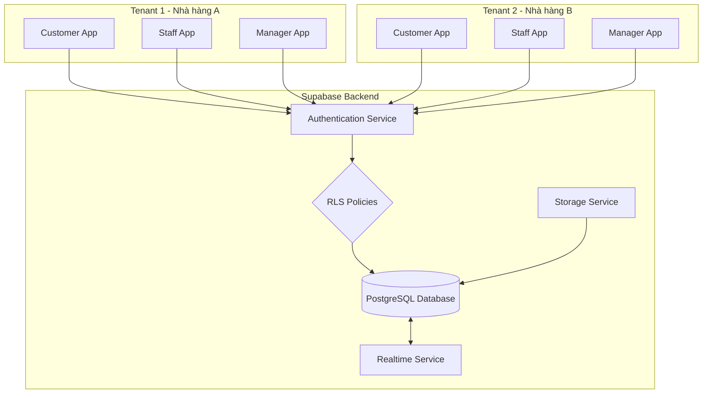
```mermaid
graph TB
    subgraph "Tenant 1 - Nhà hàng A"
        C1[Customer App]
        S1[Staff App]
        M1[Manager App]
    end
    
    subgraph "Tenant 2 - Nhà hàng B"
        C2[Customer App]
        S2[Staff App]
        M2[Manager App]
    end
    
    subgraph "Supabase Backend"
        AUTH[Authentication Service]
        DB[(PostgreSQL Database)]
        RT[Realtime Service]
        STG[Storage Service]
        RLS{RLS Policies}
    end
    
    C1 & S1 & M1 --> AUTH
    C2 & S2 & M2 --> AUTH
    AUTH --> RLS
    RLS --> DB
    DB <--> RT
    STG --> DB
```

**Đặc điểm của mô hình Multi-tenant:**

1. **Shared Database**: Tất cả tenant dùng chung một database PostgreSQL.
2. **Shared Schema**: Các bảng dữ liệu chung, phân biệt bằng cột `tenant_id`.
3. **RLS Isolation**: Row-Level Security đảm bảo mỗi tenant chỉ thấy dữ liệu của mình.
4. **Centralized Auth**: Supabase Auth quản lý xác thực tập trung.

> [!IMPORTANT]
> **Ưu điểm của mô hình này:**
> - Chi phí vận hành thấp (một database cho nhiều tenant)
> - Dễ bảo trì và nâng cấp
> - Dữ liệu vẫn được cô lập hoàn toàn nhờ RLS

### 3.2.2. Kiến trúc ứng dụng di động

Ứng dụng Android được xây dựng theo kiến trúc **Clean Architecture** kết hợp với mô hình **MVVM**.

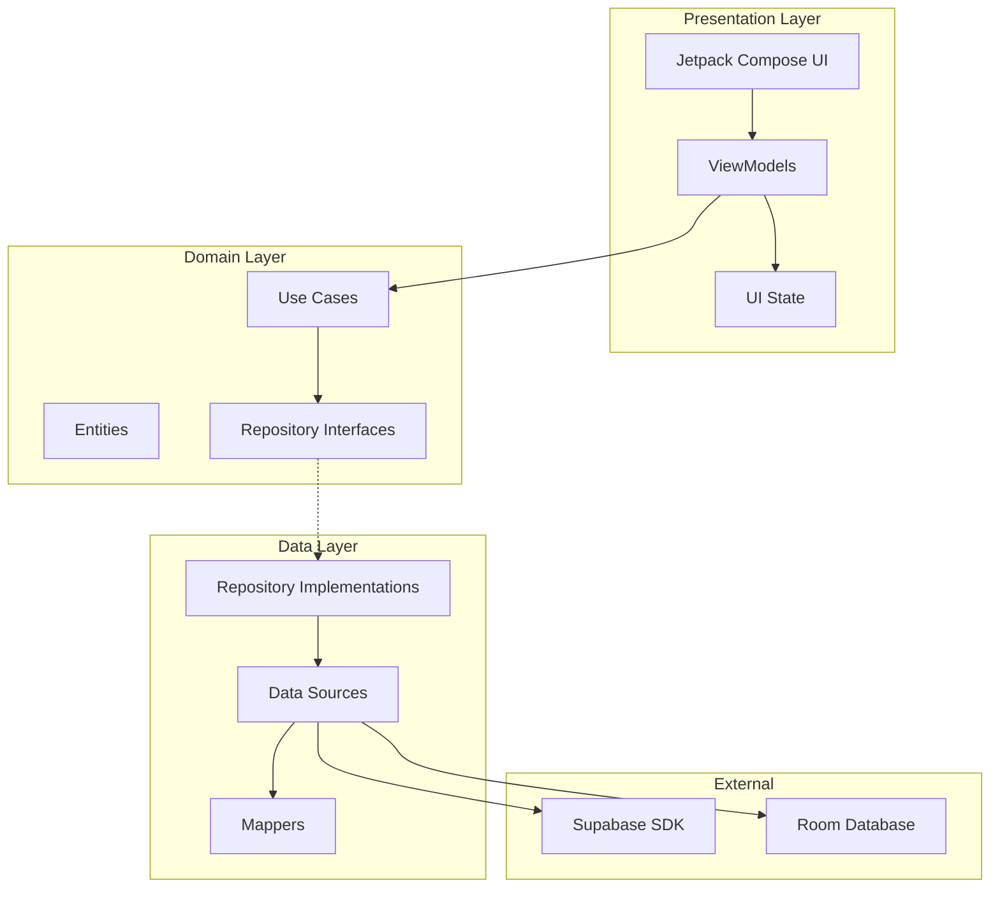
```mermaid
graph TB
    subgraph "Presentation Layer"
        UI[Jetpack Compose UI]
        VM[ViewModels]
        STATE[UI State]
    end
    
    subgraph "Domain Layer"
        UC[Use Cases]
        ENTITY[Entities]
        REPO_INT[Repository Interfaces]
    end
    
    subgraph "Data Layer"
        REPO_IMPL[Repository Implementations]
        DS[Data Sources]
        MAPPER[Mappers]
    end
    
    subgraph "External"
        SUPABASE[Supabase SDK]
        ROOM[Room Database]
    end
    
    UI --> VM
    VM --> STATE
    VM --> UC
    UC --> REPO_INT
    REPO_INT -.-> REPO_IMPL
    REPO_IMPL --> DS
    DS --> MAPPER
    DS --> SUPABASE
    DS --> ROOM
```

**Các tầng kiến trúc:**

**Tầng Presentation (Giao diện)** bao gồm các thành phần UI được xây dựng bằng Jetpack Compose, ViewModels và UI State. Tầng này chịu trách nhiệm hiển thị giao diện người dùng và xử lý các tương tác như nhấn nút, nhập liệu, điều hướng màn hình. ViewModel đóng vai trò cầu nối giữa UI và logic nghiệp vụ, quản lý trạng thái của màn hình thông qua StateFlow.

**Tầng Domain (Nghiệp vụ)** chứa các Use Cases và Entities - đây là trái tim của ứng dụng. Tầng này định nghĩa các quy tắc nghiệp vụ như cách tạo đơn hàng, cách tính tổng tiền, cách validate dữ liệu. Các Use Cases đóng gói từng hành động cụ thể mà người dùng có thể thực hiện, đảm bảo logic nghiệp vụ độc lập với framework và dễ dàng kiểm thử.

**Tầng Data (Dữ liệu)** bao gồm Repository Implementations và DataSources. Tầng này chịu trách nhiệm truy cập dữ liệu từ các nguồn khác nhau như Supabase API (remote) và Room Database (local). Mappers chuyển đổi dữ liệu giữa các định dạng khác nhau, ví dụ từ JSON response sang Entity objects.

> [!TIP]
> **Gợi ý hình ảnh:** Vẽ sơ đồ cấu trúc package trong Android Studio để minh họa tổ chức thư mục theo Clean Architecture.

## 3.3. Thiết kế cơ sở dữ liệu

### 3.3.1. Mô hình ERD

Sơ đồ Entity-Relationship mô tả cấu trúc cơ sở dữ liệu của hệ thống OneOrder:

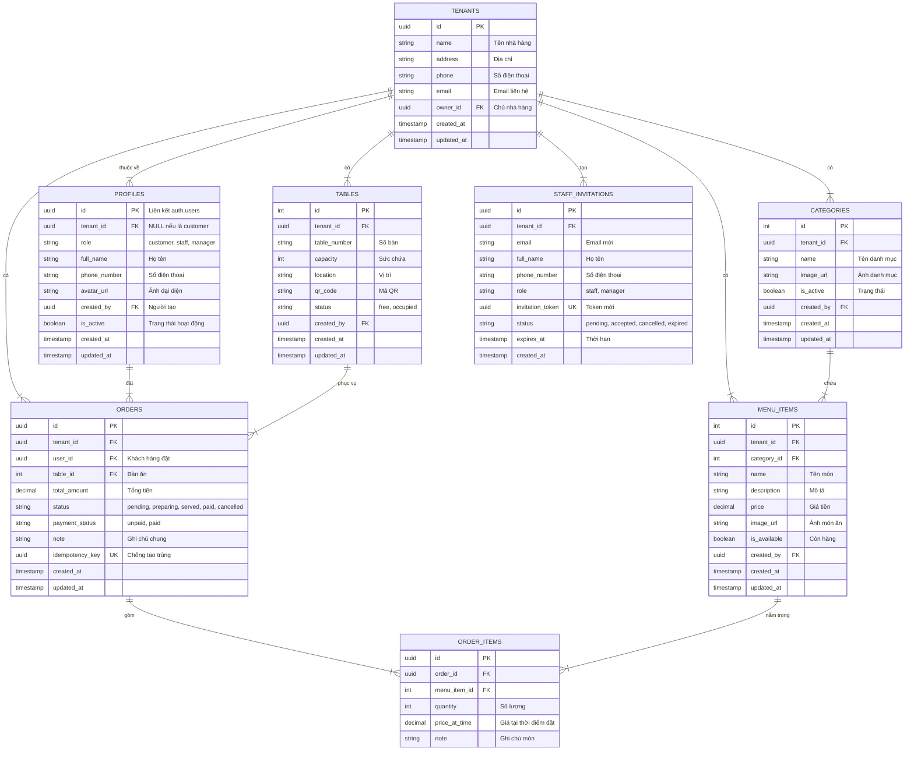
```mermaid
erDiagram
    TENANTS {
        uuid id PK
        string name "Tên nhà hàng"
        string address "Địa chỉ"
        string phone "Số điện thoại"
        string email "Email liên hệ"
        uuid owner_id FK "Chủ nhà hàng"
        timestamp created_at
        timestamp updated_at
    }

    PROFILES {
        uuid id PK "Liên kết auth.users"
        uuid tenant_id FK "NULL nếu là customer"
        string role "customer, staff, manager"
        string full_name "Họ tên"
        string phone_number "Số điện thoại"
        string avatar_url "Ảnh đại diện"
        uuid created_by FK "Người tạo"
        boolean is_active "Trạng thái hoạt động"
        timestamp created_at
        timestamp updated_at
    }

    CATEGORIES {
        int id PK
        uuid tenant_id FK
        string name "Tên danh mục"
        string image_url "Ảnh danh mục"
        boolean is_active "Trạng thái"
        uuid created_by FK
        timestamp created_at
        timestamp updated_at
    }

    MENU_ITEMS {
        int id PK
        uuid tenant_id FK
        int category_id FK
        string name "Tên món"
        string description "Mô tả"
        decimal price "Giá tiền"
        string image_url "Ảnh món ăn"
        boolean is_available "Còn hàng"
        uuid created_by FK
        timestamp created_at
        timestamp updated_at
    }

    TABLES {
        int id PK
        uuid tenant_id FK
        string table_number "Số bàn"
        int capacity "Sức chứa"
        string location "Vị trí"
        string qr_code "Mã QR"
        string status "free, occupied"
        uuid created_by FK
        timestamp created_at
        timestamp updated_at
    }

    ORDERS {
        uuid id PK
        uuid tenant_id FK
        uuid user_id FK "Khách hàng đặt"
        int table_id FK "Bàn ăn"
        decimal total_amount "Tổng tiền"
        string status "pending, preparing, served, paid, cancelled"
        string payment_status "unpaid, paid"
        string note "Ghi chú chung"
        uuid idempotency_key UK "Chống tạo trùng"
        timestamp created_at
        timestamp updated_at
    }

    ORDER_ITEMS {
        uuid id PK
        uuid order_id FK
        int menu_item_id FK
        int quantity "Số lượng"
        decimal price_at_time "Giá tại thời điểm đặt"
        string note "Ghi chú món"
    }

    STAFF_INVITATIONS {
        uuid id PK
        uuid tenant_id FK
        string email "Email mời"
        string full_name "Họ tên"
        string phone_number "Số điện thoại"
        string role "staff, manager"
        uuid invitation_token UK "Token mời"
        string status "pending, accepted, cancelled, expired"
        timestamp expires_at "Thời hạn"
        timestamp created_at
    }

    TENANTS ||--|{ PROFILES : "thuộc về"
    TENANTS ||--|{ CATEGORIES : "có"
    TENANTS ||--|{ MENU_ITEMS : "có"
    TENANTS ||--|{ TABLES : "có"
    TENANTS ||--|{ ORDERS : "có"
    TENANTS ||--|{ STAFF_INVITATIONS : "tạo"
    CATEGORIES ||--|{ MENU_ITEMS : "chứa"
    PROFILES ||--|{ ORDERS : "đặt"
    TABLES ||--|{ ORDERS : "phục vụ"
    ORDERS ||--|{ ORDER_ITEMS : "gồm"
    MENU_ITEMS ||--|{ ORDER_ITEMS : "nằm trong"
```

> [!TIP]
> **Gợi ý hình ảnh:** Chụp màn hình Table Editor trên Supabase Dashboard để minh họa cấu trúc các bảng thực tế.

### 3.3.2. Các bảng dữ liệu chính

#### Bảng tenants - Thông tin nhà hàng

Bảng này lưu trữ thông tin của mỗi nhà hàng (tenant) trong hệ thống. Mỗi nhà hàng đăng ký sử dụng OneOrder sẽ có một bản ghi trong bảng này.

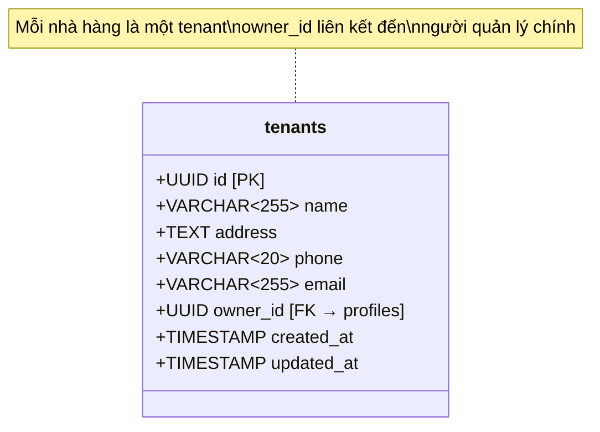
```mermaid
classDiagram
    class tenants {
        +UUID id [PK]
        +VARCHAR~255~ name
        +TEXT address
        +VARCHAR~20~ phone
        +VARCHAR~255~ email
        +UUID owner_id [FK → profiles]
        +TIMESTAMP created_at
        +TIMESTAMP updated_at
    }
    note for tenants "Mỗi nhà hàng là một tenant\nowner_id liên kết đến\nngười quản lý chính"
```

#### Bảng profiles - Thông tin người dùng

Bảng mở rộng từ `auth.users` của Supabase, lưu thông tin bổ sung của người dùng. Cột `tenant_id` xác định nhân viên thuộc nhà hàng nào, hoặc `NULL` nếu là khách hàng.

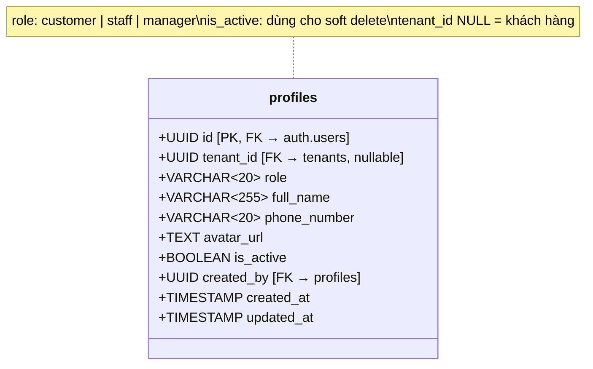
```mermaid
classDiagram
    class profiles {
        +UUID id [PK, FK → auth.users]
        +UUID tenant_id [FK → tenants, nullable]
        +VARCHAR~20~ role
        +VARCHAR~255~ full_name
        +VARCHAR~20~ phone_number
        +TEXT avatar_url
        +BOOLEAN is_active
        +UUID created_by [FK → profiles]
        +TIMESTAMP created_at
        +TIMESTAMP updated_at
    }
    note for profiles "role: customer | staff | manager\nis_active: dùng cho soft delete\ntenant_id NULL = khách hàng"
```

#### Bảng orders - Đơn hàng

Bảng lưu trữ thông tin đơn hàng, là bảng quan trọng nhất trong quy trình nghiệp vụ. Mỗi đơn hàng liên kết với một tenant, một user (khách hàng) và một bàn ăn.

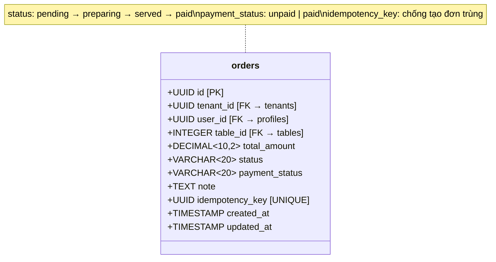
```mermaid
classDiagram
    class orders {
        +UUID id [PK]
        +UUID tenant_id [FK → tenants]
        +UUID user_id [FK → profiles]
        +INTEGER table_id [FK → tables]
        +DECIMAL~10,2~ total_amount
        +VARCHAR~20~ status
        +VARCHAR~20~ payment_status
        +TEXT note
        +UUID idempotency_key [UNIQUE]
        +TIMESTAMP created_at
        +TIMESTAMP updated_at
    }
    note for orders "status: pending → preparing → served → paid\npayment_status: unpaid | paid\nidempotency_key: chống tạo đơn trùng"
```

> [!NOTE]
> **Idempotency Key:** Được sử dụng để đảm bảo một đơn hàng không bị tạo trùng lặp khi có lỗi mạng. Client tạo UUID trước khi gửi request, server kiểm tra nếu key đã tồn tại thì trả về đơn hàng cũ.

### 3.3.3. Row-Level Security Policies

Row-Level Security (RLS) là tính năng quan trọng nhất để đảm bảo cô lập dữ liệu trong kiến trúc Multi-tenant. Khi RLS được bật, mỗi truy vấn đến database sẽ tự động được lọc dựa trên các policy đã định nghĩa.

#### Các helper functions

Để các RLS policies hoạt động hiệu quả, hệ thống sử dụng các helper functions. Đây là các hàm PostgreSQL được gọi bên trong policy để xác định thông tin của user đang thực hiện truy vấn.

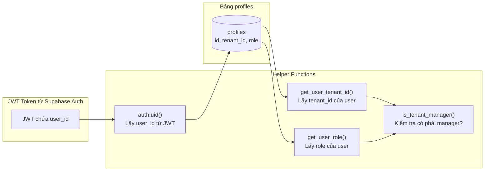
```mermaid
flowchart LR
    subgraph "JWT Token từ Supabase Auth"
        JWT[JWT chứa user_id]
    end
    
    subgraph "Helper Functions"
        F1["auth.uid()<br/>Lấy user_id từ JWT"]
        F2["get_user_tenant_id()<br/>Lấy tenant_id của user"]
        F3["get_user_role()<br/>Lấy role của user"]
        F4["is_tenant_manager()<br/>Kiểm tra có phải manager?"]
    end
    
    subgraph "Bảng profiles"
        PROFILES[(profiles<br/>id, tenant_id, role)]
    end
    
    JWT --> F1
    F1 --> PROFILES
    PROFILES --> F2
    PROFILES --> F3
    F2 --> F4
    F3 --> F4
```

**Giải thích các functions:**

**`auth.uid()`** - Đây là hàm có sẵn của Supabase, trả về `user_id` của người dùng đang đăng nhập (được trích xuất từ JWT token). Hàm này là nền tảng để xác định "ai đang thực hiện truy vấn".

**`get_user_tenant_id()`** - Hàm tự định nghĩa, truy vấn bảng `profiles` để lấy `tenant_id` của user hiện tại. Staff và Manager sẽ có `tenant_id`, còn Customer sẽ có giá trị `NULL`.

**`get_user_role()`** - Hàm tự định nghĩa, trả về role của user hiện tại (`customer`, `staff`, hoặc `manager`). Dùng để phân biệt quyền hạn giữa các vai trò.

**`is_tenant_manager(check_tenant_id)`** - Hàm kiểm tra user hiện tại có phải là manager của một tenant cụ thể hay không. Trả về `TRUE` hoặc `FALSE`.

> [!TIP]
> **Gợi ý hình ảnh:** Chụp màn hình phần Database → Functions trên Supabase Dashboard để minh họa các functions đã tạo.

**Mã nguồn SQL của các helper functions:**

```sql
-- Lấy tenant_id của user hiện tại
CREATE OR REPLACE FUNCTION get_user_tenant_id()
RETURNS UUID AS $$
BEGIN
  RETURN (
    SELECT tenant_id 
    FROM profiles 
    WHERE id = auth.uid()
  );
END;
$$ LANGUAGE plpgsql SECURITY DEFINER;

-- Lấy role của user hiện tại
CREATE OR REPLACE FUNCTION get_user_role()
RETURNS TEXT AS $$
BEGIN
  RETURN (
    SELECT role 
    FROM profiles 
    WHERE id = auth.uid()
  );
END;
$$ LANGUAGE plpgsql SECURITY DEFINER;

-- Kiểm tra user có phải manager của tenant không
CREATE OR REPLACE FUNCTION is_tenant_manager(check_tenant_id UUID)
RETURNS BOOLEAN AS $$
BEGIN
  RETURN EXISTS (
    SELECT 1 
    FROM profiles 
    WHERE id = auth.uid() 
      AND tenant_id = check_tenant_id 
      AND role = 'manager'
  );
END;
$$ LANGUAGE plpgsql SECURITY DEFINER;
```

> [!NOTE]
> **SECURITY DEFINER**: Các hàm được đánh dấu `SECURITY DEFINER` sẽ chạy với quyền của người tạo hàm (thường là superuser), cho phép truy vấn bảng `profiles` ngay cả khi user bình thường không có quyền trực tiếp.

#### RLS Policies cho bảng menu_items

Mỗi bảng trong hệ thống cần được cấu hình RLS policies để kiểm soát quyền truy cập. Dưới đây là ví dụ minh họa với bảng `menu_items` - bảng chứa thông tin các món ăn của nhà hàng.

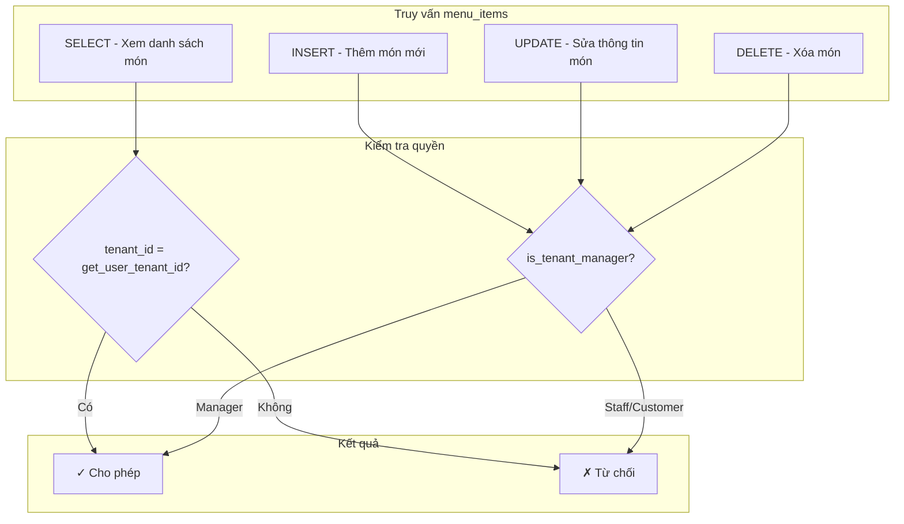
```mermaid
flowchart TD
    subgraph "Truy vấn menu_items"
        Q1[SELECT - Xem danh sách món]
        Q2[INSERT - Thêm món mới]
        Q3[UPDATE - Sửa thông tin món]
        Q4[DELETE - Xóa món]
    end
    
    subgraph "Kiểm tra quyền"
        C1{tenant_id = get_user_tenant_id?}
        C2{is_tenant_manager?}
    end
    
    subgraph "Kết quả"
        OK[✓ Cho phép]
        DENY[✗ Từ chối]
    end
    
    Q1 --> C1
    C1 -->|Có| OK
    C1 -->|Không| DENY
    
    Q2 --> C2
    Q3 --> C2
    Q4 --> C2
    C2 -->|Manager| OK
    C2 -->|Staff/Customer| DENY
```

**Giải thích từng policy:**

**Policy SELECT (Xem):** Cho phép user xem các món ăn nếu `tenant_id` của món trùng với tenant của user. Điều này đảm bảo nhân viên nhà hàng A không thể xem thực đơn của nhà hàng B. Khách hàng cũng có thể xem menu khi họ đã quét QR của nhà hàng đó.

**Policy INSERT (Thêm):** Chỉ Manager mới được thêm món ăn mới. Hàm `is_tenant_manager(tenant_id)` kiểm tra user hiện tại có phải manager của tenant đang thao tác hay không.

**Policy UPDATE (Sửa):** Tương tự INSERT, chỉ Manager có quyền chỉnh sửa thông tin món ăn như tên, giá, mô tả, trạng thái còn hàng.

**Policy DELETE (Xóa):** Chỉ Manager được xóa món ăn khỏi hệ thống.

**Mã nguồn SQL của các policies:**

```sql
-- Policy cho SELECT: Staff và Manager của tenant được xem
CREATE POLICY "select_menu_items" ON menu_items
FOR SELECT USING (
  tenant_id = get_user_tenant_id()
  OR 
  EXISTS (
    SELECT 1 FROM orders 
    WHERE orders.tenant_id = menu_items.tenant_id
  )
);

-- Policy cho INSERT: Chỉ Manager được thêm
CREATE POLICY "insert_menu_items" ON menu_items
FOR INSERT WITH CHECK (
  is_tenant_manager(tenant_id)
);

-- Policy cho UPDATE: Chỉ Manager được sửa
CREATE POLICY "update_menu_items" ON menu_items
FOR UPDATE USING (
  is_tenant_manager(tenant_id)
);

-- Policy cho DELETE: Chỉ Manager được xóa
CREATE POLICY "delete_menu_items" ON menu_items
FOR DELETE USING (
  is_tenant_manager(tenant_id)
);
```

#### Ma trận phân quyền

Ma trận dưới đây tổng hợp quyền truy cập của từng vai trò đối với các bảng trong hệ thống. Đây là cơ sở để thiết kế RLS policies cho toàn bộ database.

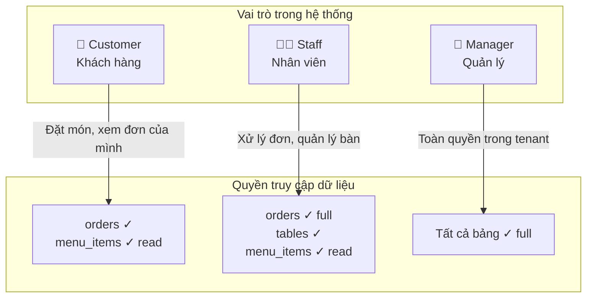
```mermaid
flowchart TB
    subgraph "Vai trò trong hệ thống"
        CUST[👤 Customer<br/>Khách hàng]
        STAFF[👨‍🍳 Staff<br/>Nhân viên]
        MGR[👔 Manager<br/>Quản lý]
    end
    
    subgraph "Quyền truy cập dữ liệu"
        CUST --> |"Đặt món, xem đơn của mình"| DATA1[orders ✓<br/>menu_items ✓ read]
        STAFF --> |"Xử lý đơn, quản lý bàn"| DATA2[orders ✓ full<br/>tables ✓<br/>menu_items ✓ read]
        MGR --> |"Toàn quyền trong tenant"| DATA3[Tất cả bảng ✓ full]
    end
```

**Chi tiết quyền theo từng bảng:**

**Bảng tenants (Thông tin nhà hàng):** Customer không có quyền truy cập. Staff chỉ đọc được thông tin nhà hàng của mình. Manager có toàn quyền quản lý thông tin nhà hàng.

**Bảng profiles (Thông tin người dùng):** Mỗi user chỉ đọc được thông tin của chính mình. Manager có thể xem và quản lý tất cả nhân viên trong tenant của mình.

**Bảng categories và menu_items (Danh mục và món ăn):** Customer đọc được khi quét QR của nhà hàng. Staff đọc được toàn bộ menu của tenant. Manager có toàn quyền thêm, sửa, xóa.

**Bảng tables (Bàn ăn):** Customer không có quyền. Staff có thể xem và cập nhật trạng thái bàn (free/occupied). Manager có toàn quyền tạo, sửa, xóa bàn.

**Bảng orders và order_items (Đơn hàng):** Customer tạo và xem đơn hàng của chính mình. Staff xem và cập nhật trạng thái tất cả đơn hàng trong tenant. Manager có toàn quyền.

**Bảng staff_invitations (Lời mời nhân viên):** Chỉ Manager có quyền tạo và quản lý lời mời, đây là cơ chế kiểm soát ai được tham gia vào tenant.

> [!TIP]
> **Gợi ý hình ảnh:** Chụp màn hình phần Policies trong Table Editor của Supabase để minh họa các RLS policies đã cấu hình.

#### Cơ chế hoạt động của RLS

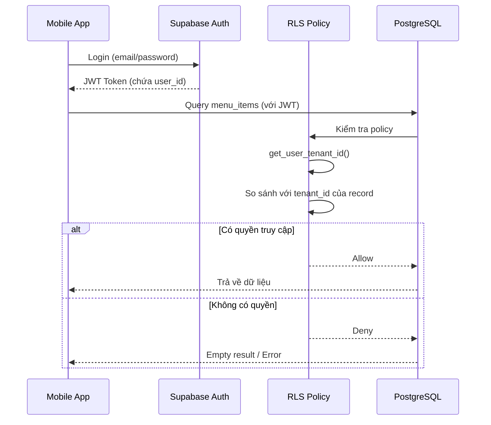
```mermaid
sequenceDiagram
    participant App as Mobile App
    participant Auth as Supabase Auth
    participant RLS as RLS Policy
    participant DB as PostgreSQL
    
    App->>Auth: Login (email/password)
    Auth-->>App: JWT Token (chứa user_id)
    App->>DB: Query menu_items (với JWT)
    DB->>RLS: Kiểm tra policy
    RLS->>RLS: get_user_tenant_id()
    RLS->>RLS: So sánh với tenant_id của record
    alt Có quyền truy cập
        RLS-->>DB: Allow
        DB-->>App: Trả về dữ liệu
    else Không có quyền
        RLS-->>DB: Deny
        DB-->>App: Empty result / Error
    end
```

## 3.4. Thiết kế luồng nghiệp vụ

### 3.4.1. Luồng đăng ký nhà hàng

Khi một chủ nhà hàng mới muốn sử dụng hệ thống, họ cần đăng ký tài khoản và tạo tenant mới. Quy trình này bao gồm hai bước chính: (1) tạo tài khoản người dùng thông qua Supabase Auth, và (2) gọi RPC function `create_restaurant_account` để tạo bản ghi tenant và cập nhật profile với role `manager`.

Sơ đồ dưới đây minh họa tương tác giữa các thành phần trong quá trình đăng ký nhà hàng:

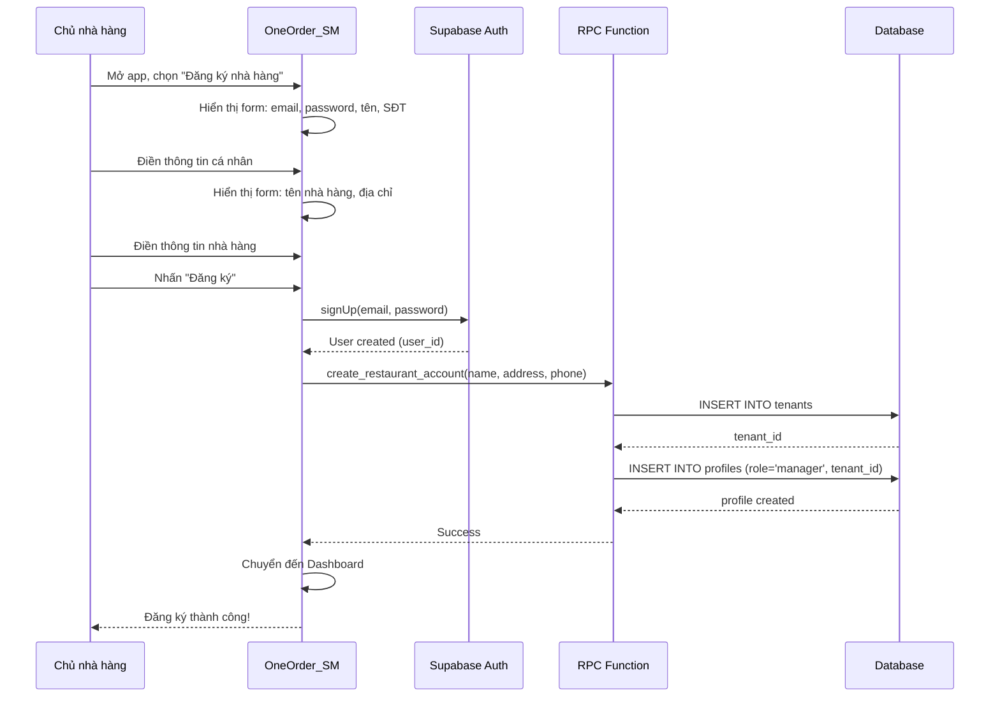
```mermaid
sequenceDiagram
    participant User as Chủ nhà hàng
    participant App as OneOrder_SM
    participant Auth as Supabase Auth
    participant RPC as RPC Function
    participant DB as Database
    
    User->>App: Mở app, chọn "Đăng ký nhà hàng"
    App->>App: Hiển thị form: email, password, tên, SĐT
    User->>App: Điền thông tin cá nhân
    App->>App: Hiển thị form: tên nhà hàng, địa chỉ
    User->>App: Điền thông tin nhà hàng
    User->>App: Nhấn "Đăng ký"
    
    App->>Auth: signUp(email, password)
    Auth-->>App: User created (user_id)
    
    App->>RPC: create_restaurant_account(name, address, phone)
    RPC->>DB: INSERT INTO tenants
    DB-->>RPC: tenant_id
    RPC->>DB: INSERT INTO profiles (role='manager', tenant_id)
    DB-->>RPC: profile created
    RPC-->>App: Success
    
    App->>App: Chuyển đến Dashboard
    App-->>User: Đăng ký thành công!
```

**SQL Function cho đăng ký nhà hàng:**

```sql
CREATE OR REPLACE FUNCTION create_restaurant_account(
  p_name TEXT,
  p_address TEXT DEFAULT NULL,
  p_phone TEXT DEFAULT NULL,
  p_email TEXT DEFAULT NULL
)
RETURNS UUID AS $$
DECLARE
  v_tenant_id UUID;
BEGIN
  -- Tạo tenant mới
  INSERT INTO tenants (name, address, phone, email, owner_id)
  VALUES (p_name, p_address, p_phone, p_email, auth.uid())
  RETURNING id INTO v_tenant_id;
  
  -- Cập nhật profile thành manager của tenant
  UPDATE profiles
  SET tenant_id = v_tenant_id,
      role = 'manager',
      updated_at = NOW()
  WHERE id = auth.uid();
  
  RETURN v_tenant_id;
END;
$$ LANGUAGE plpgsql SECURITY DEFINER;
```

### 3.4.2. Luồng quét QR và đặt món

Đây là luồng chính của ứng dụng khách hàng, từ khi quét QR đến khi đặt món thành công. Khách hàng quét mã QR tại bàn để app tự động nhận diện nhà hàng (`tenant_id`) và bàn ăn (`table_id`), sau đó xem thực đơn và thêm món vào giỏ hàng. Khi đặt món, hệ thống sử dụng `idempotency_key` để tránh tạo đơn trùng lặp trong trường hợp lỗi mạng.

Sơ đồ tuần tự sau thể hiện chi tiết các bước từ khi quét QR đến khi nhân viên nhận được thông báo đơn hàng mới qua Realtime:

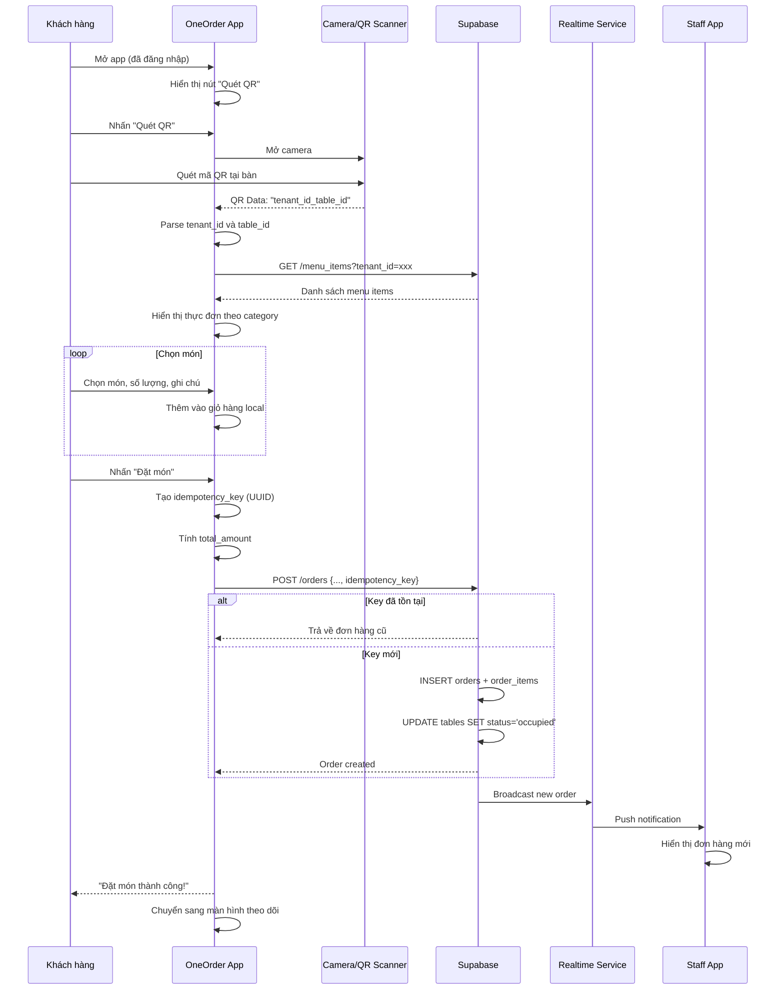
```mermaid
sequenceDiagram
    participant Customer as Khách hàng
    participant App as OneOrder App
    participant Camera as Camera/QR Scanner
    participant Supabase as Supabase
    participant Realtime as Realtime Service
    participant StaffApp as Staff App
    
    Customer->>App: Mở app (đã đăng nhập)
    App->>App: Hiển thị nút "Quét QR"
    Customer->>App: Nhấn "Quét QR"
    App->>Camera: Mở camera
    Customer->>Camera: Quét mã QR tại bàn
    Camera-->>App: QR Data: "tenant_id_table_id"
    
    App->>App: Parse tenant_id và table_id
    App->>Supabase: GET /menu_items?tenant_id=xxx
    Supabase-->>App: Danh sách menu items
    App->>App: Hiển thị thực đơn theo category
    
    loop Chọn món
        Customer->>App: Chọn món, số lượng, ghi chú
        App->>App: Thêm vào giỏ hàng local
    end
    
    Customer->>App: Nhấn "Đặt món"
    App->>App: Tạo idempotency_key (UUID)
    App->>App: Tính total_amount
    App->>Supabase: POST /orders {..., idempotency_key}
    
    alt Key đã tồn tại
        Supabase-->>App: Trả về đơn hàng cũ
    else Key mới
        Supabase->>Supabase: INSERT orders + order_items
        Supabase->>Supabase: UPDATE tables SET status='occupied'
        Supabase-->>App: Order created
    end
    
    Supabase->>Realtime: Broadcast new order
    Realtime->>StaffApp: Push notification
    StaffApp->>StaffApp: Hiển thị đơn hàng mới
    
    App-->>Customer: "Đặt món thành công!"
    App->>App: Chuyển sang màn hình theo dõi
```

### 3.4.3. Luồng xử lý đơn hàng

Nhân viên nhận đơn hàng mới qua Realtime notification và cập nhật trạng thái theo quy trình phục vụ. Đơn hàng đi qua các trạng thái: `Pending` (chờ xử lý) → `Preparing` (đang chuẩn bị) → `Served` (đã phục vụ) → `Paid` (đã thanh toán). Mỗi lần cập nhật trạng thái, khách hàng sẽ nhận được thông báo realtime trên ứng dụng của mình.

Sơ đồ trạng thái (State Diagram) dưới đây thể hiện vòng đời của một đơn hàng:

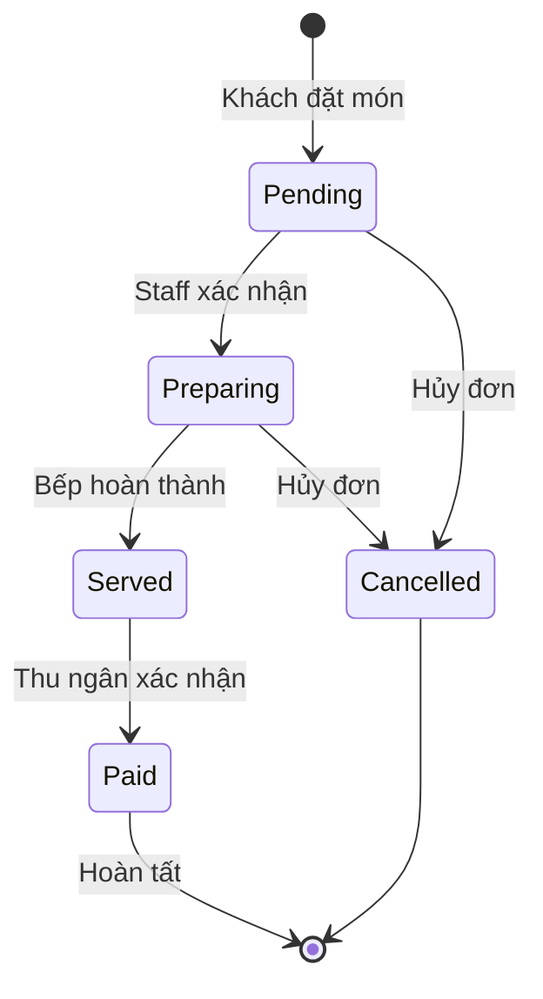
```mermaid
stateDiagram-v2
    [*] --> Pending: Khách đặt món
    Pending --> Preparing: Staff xác nhận
    Preparing --> Served: Bếp hoàn thành
    Served --> Paid: Thu ngân xác nhận
    Paid --> [*]: Hoàn tất
    
    Pending --> Cancelled: Hủy đơn
    Preparing --> Cancelled: Hủy đơn
    Cancelled --> [*]
```

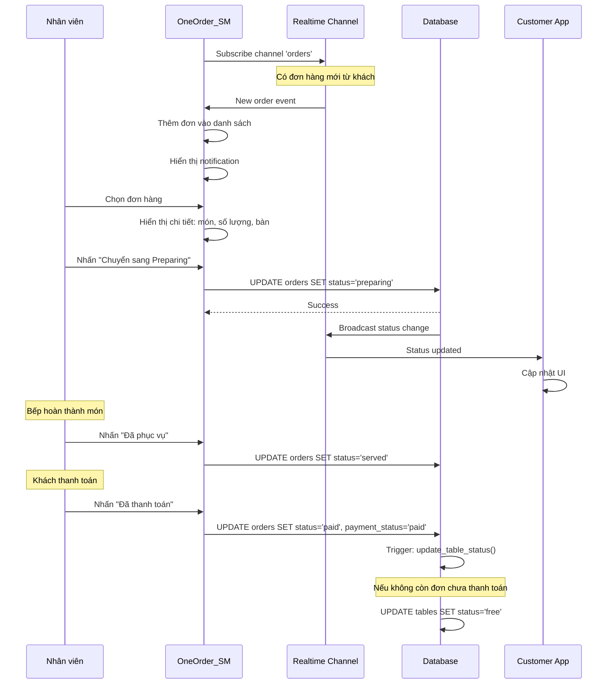
```mermaid
sequenceDiagram
    participant Staff as Nhân viên
    participant App as OneOrder_SM
    participant Realtime as Realtime Channel
    participant DB as Database
    participant CustomerApp as Customer App
    
    App->>Realtime: Subscribe channel 'orders'
    
    Note over Realtime: Có đơn hàng mới từ khách
    Realtime->>App: New order event
    App->>App: Thêm đơn vào danh sách
    App->>App: Hiển thị notification
    
    Staff->>App: Chọn đơn hàng
    App->>App: Hiển thị chi tiết: món, số lượng, bàn
    
    Staff->>App: Nhấn "Chuyển sang Preparing"
    App->>DB: UPDATE orders SET status='preparing'
    DB-->>App: Success
    DB->>Realtime: Broadcast status change
    Realtime->>CustomerApp: Status updated
    CustomerApp->>CustomerApp: Cập nhật UI
    
    Note over Staff: Bếp hoàn thành món
    Staff->>App: Nhấn "Đã phục vụ"
    App->>DB: UPDATE orders SET status='served'
    
    Note over Staff: Khách thanh toán
    Staff->>App: Nhấn "Đã thanh toán"
    App->>DB: UPDATE orders SET status='paid', payment_status='paid'
    DB->>DB: Trigger: update_table_status()
    
    Note over DB: Nếu không còn đơn chưa thanh toán
    DB->>DB: UPDATE tables SET status='free'
```

### 3.4.4. Luồng quản lý thực đơn

Manager có toàn quyền thêm, sửa, xóa món ăn trong thực đơn nhà hàng. Khi thêm món mới, hình ảnh được upload lên Supabase Storage trước, sau đó URL được lưu vào database cùng với thông tin món ăn. RLS policy tự động kiểm tra quyền manager trước khi cho phép thao tác.

Sơ đồ tuần tự sau minh họa quy trình thêm món mới với việc upload hình ảnh:

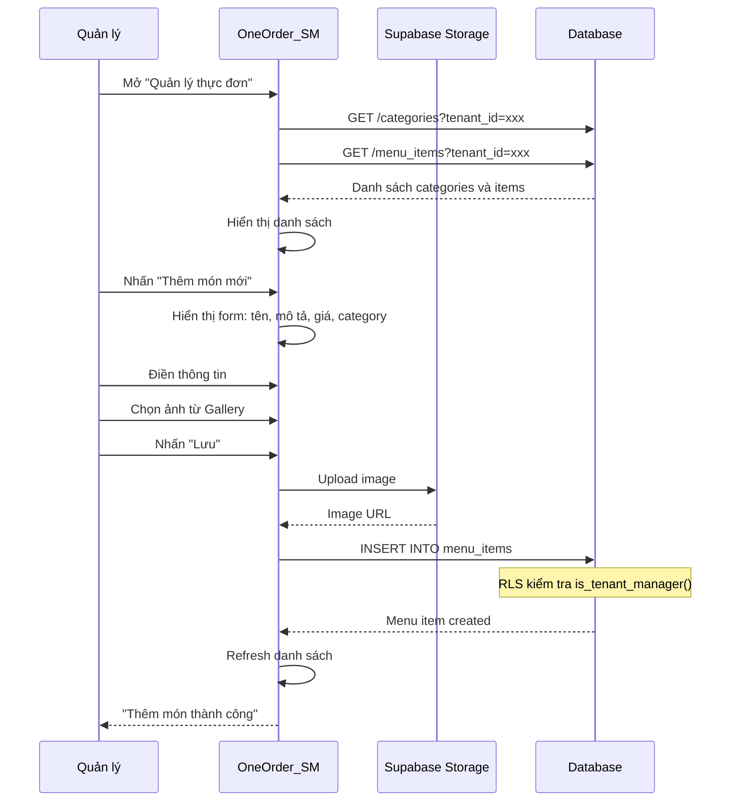
```mermaid
sequenceDiagram
    participant Manager as Quản lý
    participant App as OneOrder_SM
    participant Storage as Supabase Storage
    participant DB as Database
    
    Manager->>App: Mở "Quản lý thực đơn"
    App->>DB: GET /categories?tenant_id=xxx
    App->>DB: GET /menu_items?tenant_id=xxx
    DB-->>App: Danh sách categories và items
    App->>App: Hiển thị danh sách
    
    Manager->>App: Nhấn "Thêm món mới"
    App->>App: Hiển thị form: tên, mô tả, giá, category
    Manager->>App: Điền thông tin
    Manager->>App: Chọn ảnh từ Gallery
    
    Manager->>App: Nhấn "Lưu"
    
    App->>Storage: Upload image
    Storage-->>App: Image URL
    
    App->>DB: INSERT INTO menu_items
    Note over DB: RLS kiểm tra is_tenant_manager()
    DB-->>App: Menu item created
    
    App->>App: Refresh danh sách
    App-->>Manager: "Thêm món thành công"
```

### 3.4.5. Luồng quản lý bàn

Manager tạo và quản lý các bàn ăn trong nhà hàng. Mỗi bàn được gán một mã QR duy nhất chứa thông tin `tenant_id` và `table_id`. Khách hàng quét mã QR này để bắt đầu đặt món. Manager có thể tải xuống hình ảnh QR để in và đặt tại bàn.

Sơ đồ dưới đây thể hiện quy trình tạo bàn mới và sinh mã QR:

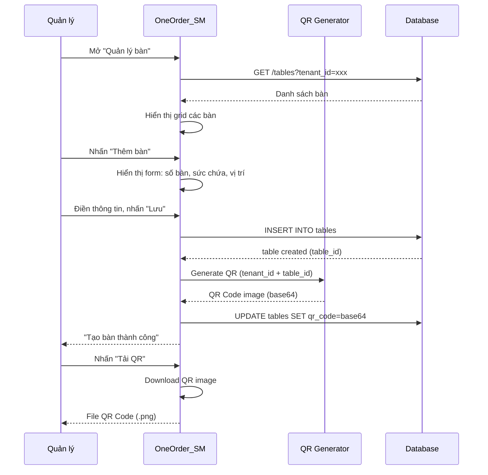
```mermaid
sequenceDiagram
    participant Manager as Quản lý
    participant App as OneOrder_SM
    participant QRLib as QR Generator
    participant DB as Database
    
    Manager->>App: Mở "Quản lý bàn"
    App->>DB: GET /tables?tenant_id=xxx
    DB-->>App: Danh sách bàn
    App->>App: Hiển thị grid các bàn
    
    Manager->>App: Nhấn "Thêm bàn"
    App->>App: Hiển thị form: số bàn, sức chứa, vị trí
    Manager->>App: Điền thông tin, nhấn "Lưu"
    
    App->>DB: INSERT INTO tables
    DB-->>App: table created (table_id)
    
    App->>QRLib: Generate QR (tenant_id + table_id)
    QRLib-->>App: QR Code image (base64)
    
    App->>DB: UPDATE tables SET qr_code=base64
    App-->>Manager: "Tạo bàn thành công"
    
    Manager->>App: Nhấn "Tải QR"
    App->>App: Download QR image
    App-->>Manager: File QR Code (.png)
```

### 3.4.6. Luồng thống kê doanh thu

Manager xem dashboard để nắm bắt tình hình kinh doanh của nhà hàng. Dashboard hiển thị các thông tin như doanh thu hôm nay, số đơn hàng, biểu đồ doanh thu 7 ngày gần nhất. Các truy vấn được thực hiện song song (parallel) để tối ưu thời gian tải trang.

Sơ đồ tuần tự sau minh họa cách ứng dụng truy vấn dữ liệu thống kê từ database:

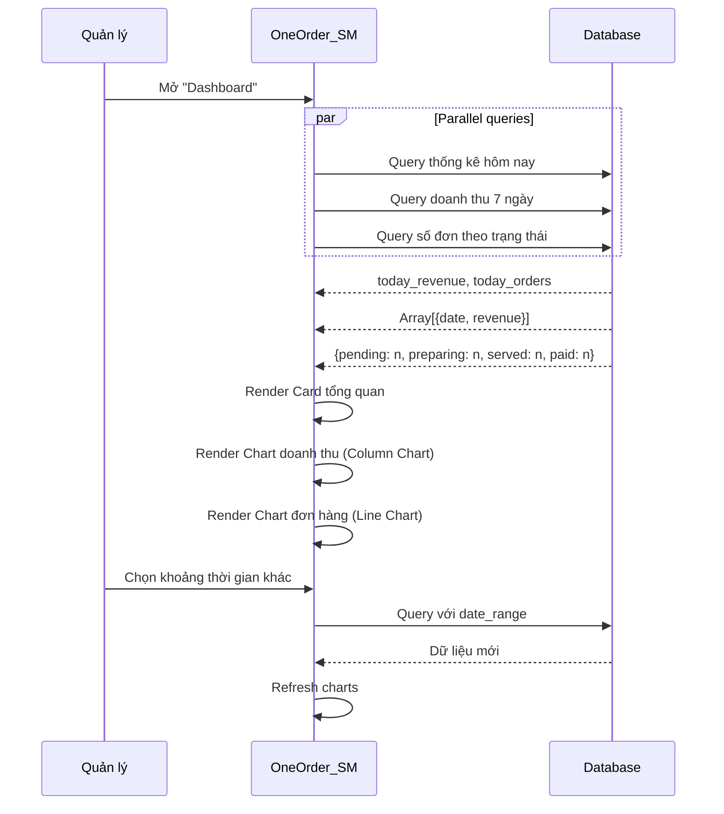
```mermaid
sequenceDiagram
    participant Manager as Quản lý
    participant App as OneOrder_SM
    participant DB as Database
    
    Manager->>App: Mở "Dashboard"
    
    par Parallel queries
        App->>DB: Query thống kê hôm nay
        App->>DB: Query doanh thu 7 ngày
        App->>DB: Query số đơn theo trạng thái
    end
    
    DB-->>App: today_revenue, today_orders
    DB-->>App: Array[{date, revenue}]
    DB-->>App: {pending: n, preparing: n, served: n, paid: n}
    
    App->>App: Render Card tổng quan
    App->>App: Render Chart doanh thu (Column Chart)
    App->>App: Render Chart đơn hàng (Line Chart)
    
    Manager->>App: Chọn khoảng thời gian khác
    App->>DB: Query với date_range
    DB-->>App: Dữ liệu mới
    App->>App: Refresh charts
```

**SQL Query thống kê doanh thu:**

```sql
-- Thống kê doanh thu theo ngày
SELECT 
  DATE(created_at) as date,
  COUNT(*) as order_count,
  SUM(total_amount) as revenue
FROM orders
WHERE tenant_id = get_user_tenant_id()
  AND status = 'paid'
  AND created_at >= CURRENT_DATE - INTERVAL '7 days'
GROUP BY DATE(created_at)
ORDER BY date;
```

## 3.5. Thiết kế giao diện người dùng

### 3.5.1. Giao diện ứng dụng khách hàng (OneOrder)

#### Sitemap ứng dụng

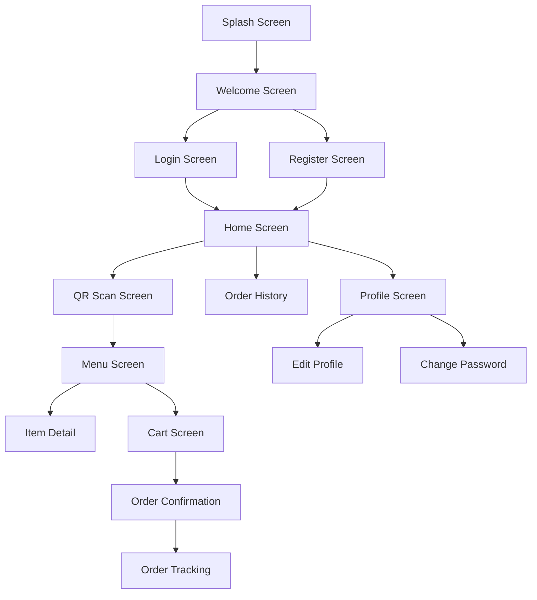
```mermaid
graph TD
    SPLASH[Splash Screen] --> WELCOME[Welcome Screen]
    WELCOME --> LOGIN[Login Screen]
    WELCOME --> REGISTER[Register Screen]
    LOGIN --> HOME[Home Screen]
    REGISTER --> HOME
    
    HOME --> SCAN[QR Scan Screen]
    HOME --> HISTORY[Order History]
    HOME --> PROFILE[Profile Screen]
    
    SCAN --> MENU[Menu Screen]
    MENU --> ITEM[Item Detail]
    MENU --> CART[Cart Screen]
    CART --> CONFIRM[Order Confirmation]
    CONFIRM --> TRACKING[Order Tracking]
    
    PROFILE --> EDIT[Edit Profile]
    PROFILE --> PASSWORD[Change Password]
```

#### Các màn hình chính

**Màn hình Login (Đăng nhập)** là điểm bắt đầu khi người dùng mở ứng dụng. Màn hình này bao gồm các trường nhập Email và Password, checkbox "Ghi nhớ đăng nhập", nút Đăng nhập và link "Quên mật khẩu". Giao diện được thiết kế đơn giản, tập trung vào việc đăng nhập nhanh chóng.

**Màn hình Register (Đăng ký)** cho phép người dùng mới tạo tài khoản. Form đăng ký yêu cầu các thông tin: Họ tên, Email, Số điện thoại, Mật khẩu và Xác nhận mật khẩu. Các trường được validate realtime để đảm bảo dữ liệu hợp lệ trước khi submit.

**Màn hình Home (Trang chủ)** là màn hình chính sau khi đăng nhập. Nổi bật nhất là nút "Quét QR" lớn ở giữa màn hình, mời gọi người dùng bắt đầu đặt món. Bottom navigation bar cho phép chuyển đổi nhanh giữa các chức năng: Home, Lịch sử đơn, và Hồ sơ cá nhân.

**Màn hình QR Scan (Quét QR)** sử dụng camera để quét mã QR tại bàn. Giao diện bao gồm camera view toàn màn hình, khung guide hướng dẫn vị trí quét, nút bật/tắt đèn flash cho điều kiện ánh sáng yếu, và nút đóng để quay lại.

**Màn hình Menu (Thực đơn)** hiển thị danh sách món ăn của nhà hàng. Phía trên là các tab category để lọc theo loại món (Món chính, Đồ uống, Tráng miệng...). Mỗi món hiển thị dạng card với ảnh, tên, giá. Search bar cho phép tìm kiếm nhanh. FAB (Floating Action Button) ở góc dưới hiển thị số lượng món trong giỏ.

**Màn hình Item Detail (Chi tiết món)** cho xem thông tin đầy đủ của một món ăn. Bao gồm ảnh lớn, tên món, mô tả chi tiết, giá tiền, bộ chọn số lượng (+/-), và ô nhập ghi chú đặc biệt (ví dụ: "không hành", "ít cay").

**Màn hình Cart (Giỏ hàng)** liệt kê tất cả món đã chọn với số lượng và giá. Người dùng có thể chỉnh sửa số lượng hoặc xóa món. Phía dưới hiển thị tổng tiền và nút "Đặt món" để xác nhận đơn hàng.

**Màn hình Order Tracking (Theo dõi đơn)** cho phép khách hàng theo dõi trạng thái đơn hàng theo thời gian thực. Timeline visual hiển thị các bước: Đã đặt → Đang chuẩn bị → Đã phục vụ → Đã thanh toán. Dưới timeline là danh sách món và thông tin bàn ăn.

**Màn hình History (Lịch sử đơn)** hiển thị tất cả đơn hàng đã đặt. Mỗi đơn hiển thị: tên nhà hàng, số bàn, ngày giờ, tổng tiền, trạng thái. Filter cho phép lọc theo trạng thái (đã thanh toán, đã hủy) hoặc khoảng thời gian.

**Màn hình Profile (Hồ sơ)** hiển thị thông tin cá nhân của người dùng và các tùy chọn: Chỉnh sửa thông tin, Đổi mật khẩu, Đăng xuất.

> [!TIP]
> **Gợi ý hình ảnh:** Chụp màn hình các giao diện chính của ứng dụng OneOrder Customer để minh họa.

### 3.5.2. Giao diện ứng dụng nhân viên/quản lý (OneOrder_SM)

#### Sitemap ứng dụng

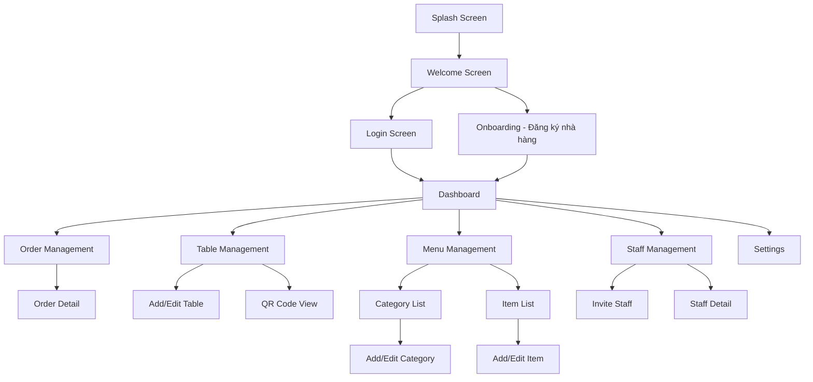
```mermaid
graph TD
    SPLASH[Splash Screen] --> WELCOME[Welcome Screen]
    WELCOME --> LOGIN[Login Screen]
    WELCOME --> ONBOARD[Onboarding - Đăng ký nhà hàng]
    
    LOGIN --> DASHBOARD[Dashboard]
    ONBOARD --> DASHBOARD
    
    DASHBOARD --> ORDERS[Order Management]
    DASHBOARD --> TABLES[Table Management]
    DASHBOARD --> MENU[Menu Management]
    DASHBOARD --> STAFF[Staff Management]
    DASHBOARD --> SETTINGS[Settings]
    
    ORDERS --> ORDER_DETAIL[Order Detail]
    TABLES --> TABLE_EDIT[Add/Edit Table]
    TABLES --> QR_VIEW[QR Code View]
    MENU --> CAT_LIST[Category List]
    MENU --> ITEM_LIST[Item List]
    CAT_LIST --> CAT_EDIT[Add/Edit Category]
    ITEM_LIST --> ITEM_EDIT[Add/Edit Item]
    STAFF --> INVITE[Invite Staff]
    STAFF --> STAFF_DETAIL[Staff Detail]
```

#### Phân quyền theo màn hình

Ứng dụng OneOrder_SM phân quyền rõ ràng giữa hai vai trò Staff và Manager, đảm bảo mỗi người chỉ truy cập được các chức năng phù hợp với công việc của mình.

**Dashboard (Tổng quan):** Cả Staff và Manager đều có thể xem dashboard, tuy nhiên Staff chỉ thấy các thông tin cơ bản như số đơn hàng đang chờ, còn Manager thấy đầy đủ thống kê doanh thu và biểu đồ.

**Order Management (Quản lý đơn hàng):** Cả hai vai trò đều có thể xem danh sách đơn hàng và cập nhật trạng thái. Đây là chức năng cốt lõi cho việc vận hành nhà hàng hàng ngày.

**Table Management (Quản lý bàn):** Staff có thể xem danh sách bàn và cập nhật trạng thái (free/occupied). Tuy nhiên, chỉ Manager mới có thể thêm, sửa, xóa bàn hoặc tải mã QR.

**Menu Management (Quản lý thực đơn):** Đây là chức năng độc quyền của Manager. Staff không thể truy cập màn hình này vì việc thay đổi menu ảnh hưởng đến toàn bộ hoạt động kinh doanh.

**Staff Management (Quản lý nhân viên):** Chỉ Manager có quyền mời nhân viên mới, xem danh sách nhân viên, hoặc vô hiệu hóa tài khoản. Điều này đảm bảo kiểm soát ai được tham gia vào tenant.

**Statistics/Reports (Thống kê/Báo cáo):** Các báo cáo chi tiết về doanh thu, món bán chạy chỉ dành cho Manager để hỗ trợ ra quyết định kinh doanh.

**Settings (Cài đặt):** Cấu hình nhà hàng như thay đổi tên, địa chỉ, thông tin liên hệ chỉ Manager được phép thực hiện.

> [!TIP]
> **Gợi ý hình ảnh:** Chụp màn hình Dashboard, Order List, Menu Management của ứng dụng OneOrder_SM.

#### Thiết kế Dashboard

Dashboard hiển thị tổng quan hoạt động nhà hàng với các thành phần:

```
┌─────────────────────────────────────────────┐
│ ONEORDER SM              [Reload] [Profile] │
├─────────────────────────────────────────────┤
│ ┌──────────────┐ ┌──────────────┐           │
│ │ Doanh thu    │ │ Đơn hàng     │           │
│ │ hôm nay      │ │ hôm nay      │           │
│ │ 12,500,000₫  │ │ 45           │           │
│ └──────────────┘ └──────────────┘           │
├─────────────────────────────────────────────┤
│ DOANH THU 7 NGÀY GẦN NHẤT                   │
│ ┌───────────────────────────────────────┐   │
│ │  █                                    │   │
│ │  █  █     █                           │   │
│ │  █  █  █  █  █     █     █            │   │
│ │ T2 T3 T4 T5 T6 T7 CN                  │   │
│ └───────────────────────────────────────┘   │
├─────────────────────────────────────────────┤
│ SỐ LƯỢNG ĐƠN HÀNG                           │
│ ┌───────────────────────────────────────┐   │
│ │     ──────────────                    │   │
│ │   /                 \                 │   │
│ │  /                   \────            │   │
│ │ T2 T3 T4 T5 T6 T7 CN                  │   │
│ └───────────────────────────────────────┘   │
├─────────────────────────────────────────────┤
│ [Orders] [Tables] [Menu] [Staff] [Settings] │
└─────────────────────────────────────────────┘
```

## 3.6. Thiết kế Storage

### 3.6.1. Cấu trúc bucket

Supabase Storage được sử dụng để lưu trữ hình ảnh cho hệ thống. Các file được tổ chức vào các bucket riêng biệt theo mục đích sử dụng:

**Bucket `menu-images`** lưu trữ hình ảnh của các món ăn trong thực đơn. Đây là bucket được sử dụng nhiều nhất vì mỗi món ăn cần có ảnh minh họa hấp dẫn. Quyền truy cập: Public read (ai cũng có thể xem), Auth write (chỉ người đăng nhập mới được upload).

**Bucket `category-images`** chứa hình ảnh đại diện cho các danh mục món ăn như "Món chính", "Đồ uống", "Tráng miệng". Giúp giao diện menu trực quan và dễ điều hướng hơn. Quyền truy cập tương tự menu-images.

**Bucket `avatars`** lưu trữ ảnh đại diện của người dùng (khách hàng, nhân viên, quản lý). Mỗi user có thể upload ảnh đại diện cho tài khoản của mình. Public read cho phép hiển thị avatar ở các nơi như danh sách nhân viên, Auth write đảm bảo chỉ chủ tài khoản mới được thay đổi ảnh.

### 3.6.2. Storage Policies

```sql
-- Policy cho bucket menu-images
CREATE POLICY "Public read access"
ON storage.objects FOR SELECT
USING (bucket_id = 'menu-images');

CREATE POLICY "Manager can upload"
ON storage.objects FOR INSERT
WITH CHECK (
  bucket_id = 'menu-images'
  AND get_user_role() = 'manager'
);

CREATE POLICY "Manager can delete own tenant images"
ON storage.objects FOR DELETE
USING (
  bucket_id = 'menu-images'
  AND get_user_role() = 'manager'
);
```

> [!TIP]
> **Gợi ý hình ảnh:** Chụp màn hình Storage Policies configuration trên Supabase Dashboard.

## 3.7. Tổng kết chương

Chương 3 đã trình bày toàn diện về thiết kế hệ thống quản lý nhà hàng và gọi món OneOrder theo mô hình Multi-tenant. Hệ thống được xây dựng trên kiến trúc Shared Database kết hợp với Row-Level Security (RLS) của PostgreSQL, cho phép nhiều nhà hàng sử dụng chung một database trong khi vẫn đảm bảo dữ liệu được cô lập hoàn toàn giữa các tenant. Các helper functions như `get_user_tenant_id()`, `get_user_role()` và `is_tenant_manager()` đóng vai trò quan trọng trong việc xác định quyền truy cập của từng người dùng.

Về thiết kế cơ sở dữ liệu, hệ thống sử dụng 8 bảng chính bao gồm tenants, profiles, categories, menu_items, tables, orders, order_items và staff_invitations. Mỗi bảng được thiết kế với các ràng buộc foreign key để đảm bảo toàn vẹn dữ liệu, đồng thời áp dụng cơ chế idempotency key để ngăn chặn việc tạo đơn hàng trùng lặp khi có sự cố về mạng.

Các luồng nghiệp vụ chính đã được thiết kế chi tiết thông qua các sơ đồ sequence diagram, bao gồm: luồng đăng ký nhà hàng sử dụng RPC function, luồng quét mã QR và đặt món với thông báo realtime đến nhân viên, luồng xử lý đơn hàng theo mô hình state machine với các trạng thái rõ ràng từ Pending đến Paid, cũng như các luồng quản lý thực đơn, quản lý bàn và thống kê doanh thu.

Về giao diện người dùng, hệ thống được chia thành hai ứng dụng riêng biệt phục vụ các đối tượng khác nhau. Ứng dụng OneOrder dành cho khách hàng được thiết kế theo hướng mobile-first, tối ưu cho việc quét QR và đặt món nhanh chóng. Ứng dụng OneOrder_SM dành cho nhân viên và quản lý được thiết kế với dashboard làm trung tâm, phân quyền rõ ràng giữa vai trò Staff và Manager để đảm bảo mỗi người chỉ truy cập được các chức năng phù hợp với công việc của mình.

Trong chương tiếp theo, báo cáo sẽ trình bày về việc triển khai cài đặt cụ thể các thành phần đã thiết kế, minh họa mã nguồn thực tế và kết quả kiểm thử hệ thống.
