# Activity Diagrams

## OneOrder (Customer App)

### 1. Login/Register
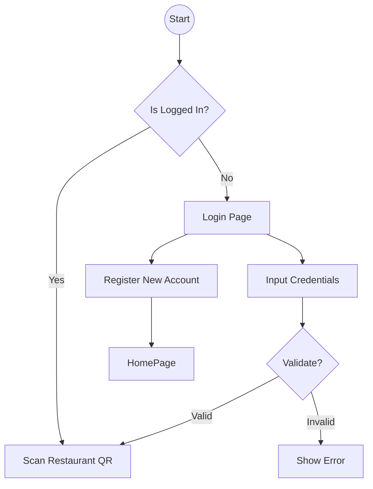

### 2. Menu Browsing (via QR)
QR code contains tenant_id to identify the restaurant.
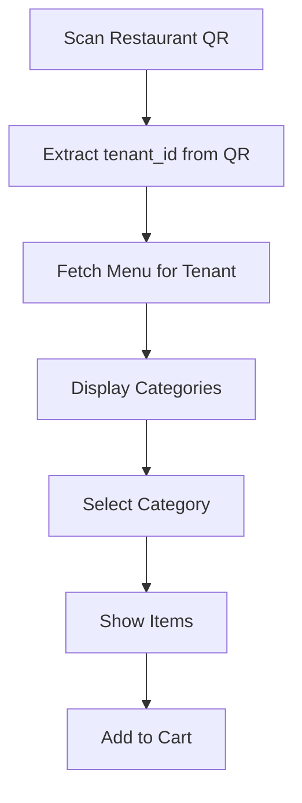

### 3. Order Placement
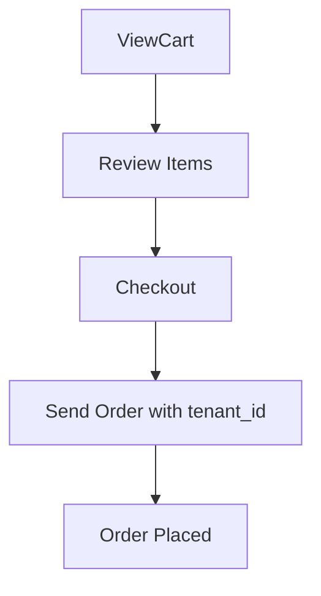

---

## OneOrder_SM (Staff/Manager App)

### 1. App Entry Flow (Multi-Tenant)
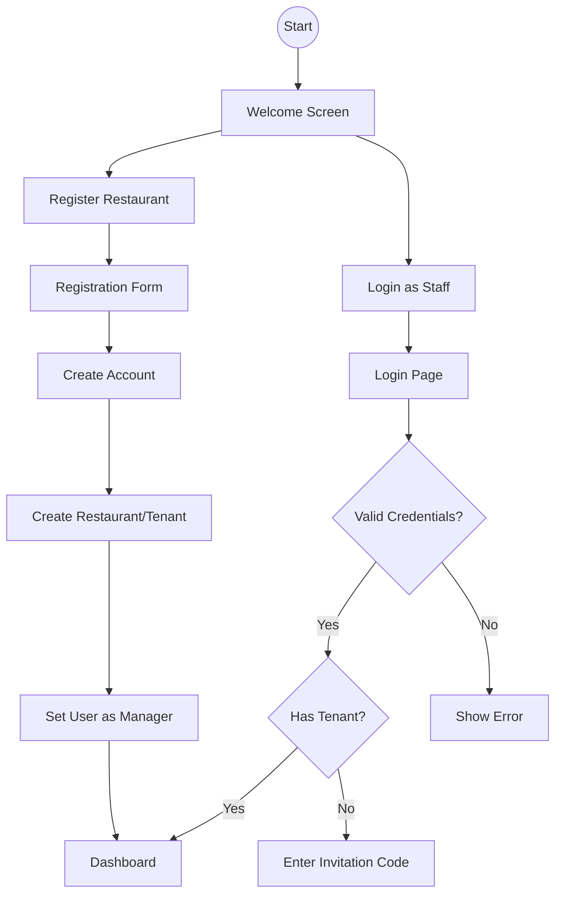

### 2. Restaurant Registration
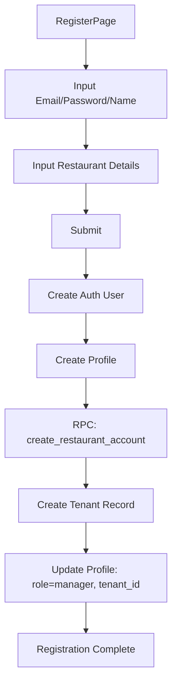

### 3. Staff Invitation System
```mermaid
graph TD
    subgraph "Manager Actions"
        StaffMgmt[Staff Management] --> CreateInvite[Create Invitation]
        CreateInvite --> InputInfo[Input Email/Name/Role]
        InputInfo --> SaveInvite[Save to staff_invitations]
        SaveInvite --> ShareToken[Share Invitation Token]
    end
    
    subgraph "Staff Actions"
        NewStaff[New Staff] --> Register[Register Account]
        Register --> EnterToken[Enter Invitation Token]
        EnterToken --> AcceptInvite[Accept Invitation]
        AcceptInvite --> LinkTenant[Link to Tenant]
        LinkTenant --> SetRole[Set Role from Invitation]
        SetRole --> Ready[Ready to Work]
    end
```

### 4. Role-Based Navigation
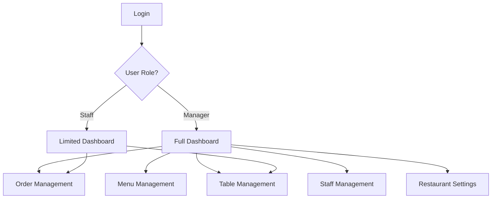

### 5. Order Management
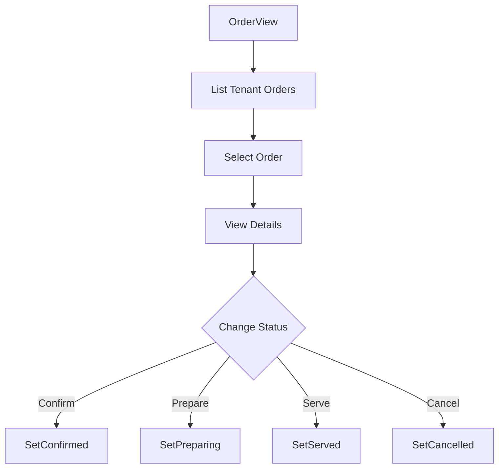

### 6. Table Management
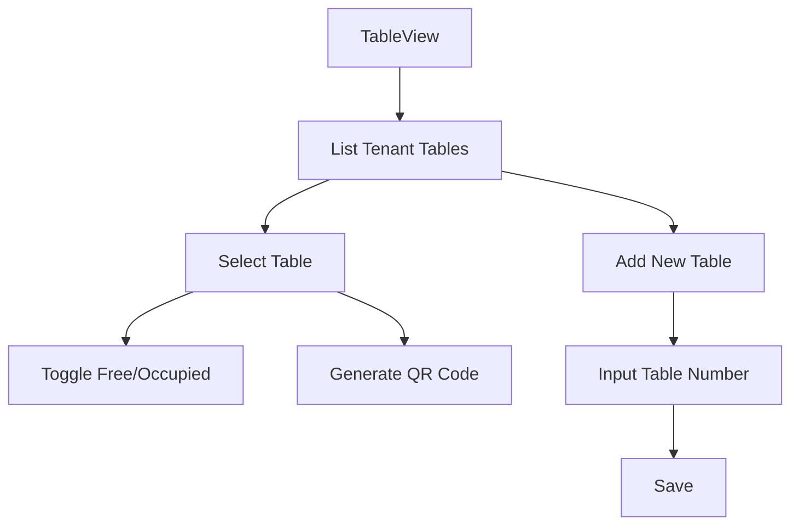

### 7. Menu Management (Manager Only)
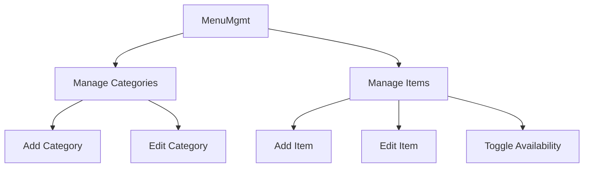

### 8. Staff Management (Manager Only)
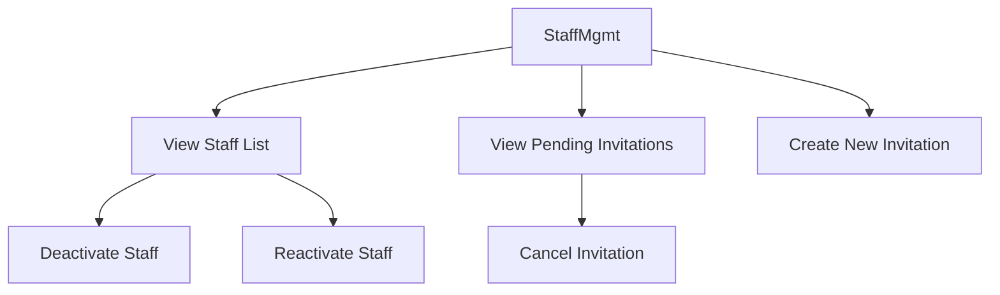

---

## Data Flow with Multi-Tenancy

### RLS Enforcement
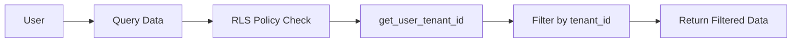

### Cross-Tenant Protection
- All queries automatically filtered by `tenant_id`
- Manager can only see their restaurant's data
- Staff can only access assigned restaurant
- Customers see menu from scanned QR's tenant

