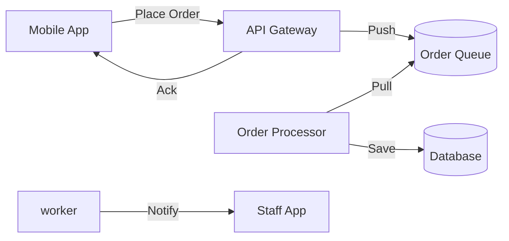
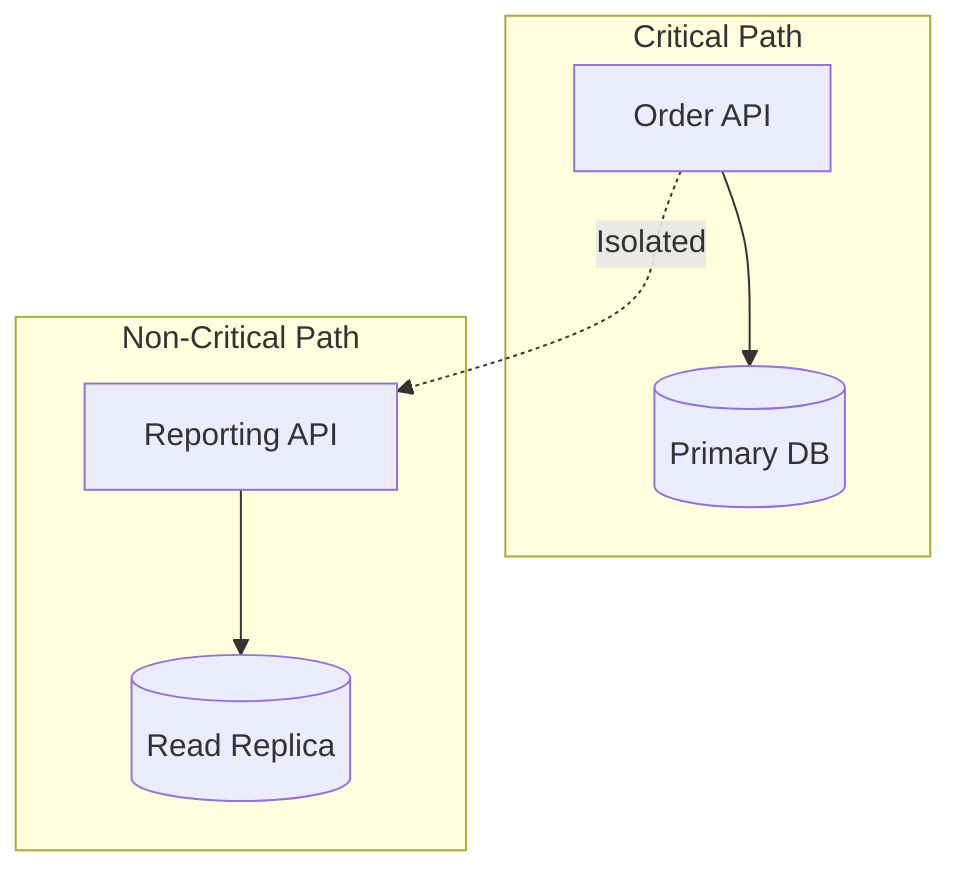
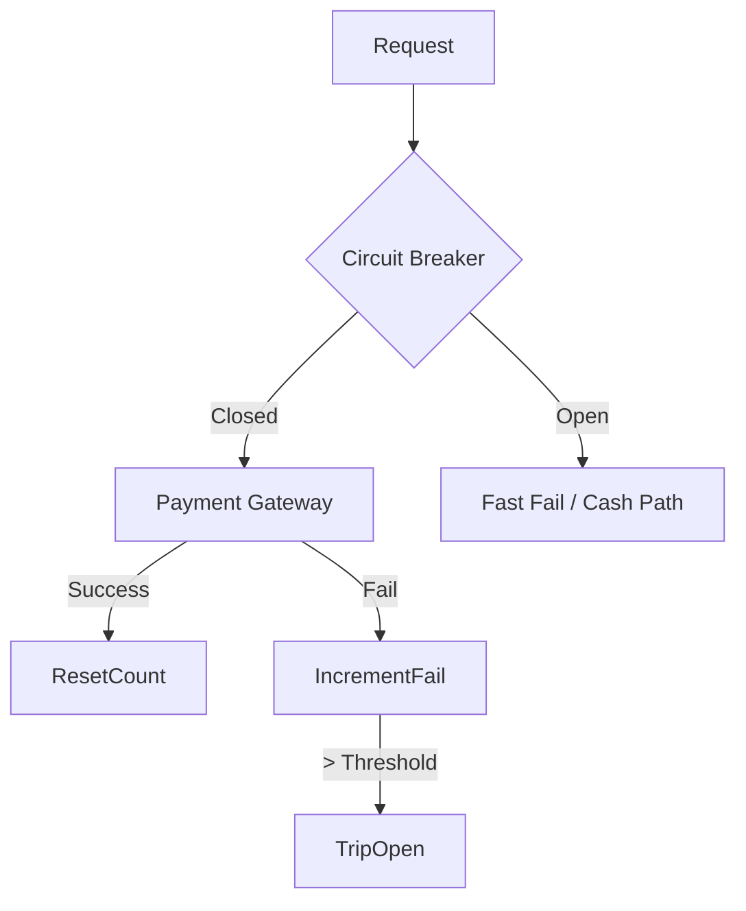

# Backend Performance Patterns

To ensure high performance, reliability, and scalability for the OneOrder backend, we will implement the following patterns.

## 1. Queue-Based Load Leveling
**Problem**: The system might experience bursts of traffic (e.g., lunch rush) where order requests exceed the immediate processing capacity of the backend.
**Solution**: Use a message queue to decouple the task submission from the task processing.
**Implementation**:
- **Mechanism**: When a user places an order, the backend API pushes the order into a queue (e.g., RabbitMQ, Redis Streams, or Supabase realtime table triggers) and immediately returns a "Received" status to the client.
- **Workers**: A separate pool of worker processes pulls orders from the queue at a manageable pace to update the database and notify staff.
- **Benefit**: Prevents the checkout service from crashing during peak loads; allows the system to process requests asynchronously.

## 2. Bulkhead Pattern
**Problem**: A failure or high load in one part of the system (e.g., Report Generation) shouldn't crash critical flows (e.g., Order Placement).
**Solution**: Isolate elements into pools so that if one fails, the others will continue to function.
**Implementation**:
- **Logic**: Separate connection pools or resource limits for "Ordering Service" vs "Reporting/Analytics Service".
- **Example**: If the Manager is running a heavy monthly report that consumes high CPU/Database IO, it should run on a separate server instance or use a dedicated database read-replica, ensuring that customers can still place orders without latency.

## 3. Idempotency
**Problem**: Network retries might cause duplicate orders if the client sends the same request twice (e.g., user clicks "Pay" twice).
**Solution**: Ensure that multiple identical requests have the same effect as a single request.
**Implementation**:
- **Mechanism**: Clients generate a unique `idempotency_key` (UUID) for every order intent.
- **Flow**: 
    1. Client sends Order with `Key: 123`.
    2. Server checks if `Key: 123` exists.
    3. If new, process order and save `Key: 123`.
    4. If exists, return the previously saved result immediately without re-processing.
- **Benefit**: Guarantees distinct transactions and accurate billing.

## 4. Circuit Breaker
**Problem**: If an external service (e.g., Payment Gateway, SMS Provider) is down, the web server shouldn't hang waiting for timeouts, which consumes resources.
**Solution**: Stop calling the failing service after a threshold of failures.
**Implementation**:
- **States**:
    - **Closed**: Requests flow normally.
    - **Open**: Recent error rate > threshold. Requests fail immediately with a fast fallback (e.g., "Cash Only" mode).
    - **Half-Open**: Allow a test request to see if the service is back.
- **Benefit**: Prevents system resource exhaustion and provides faster feedback to users during partial outages.

## 5. Retry with Exponential Backoff
**Problem**: Transient network glitches or database locks might cause a request to fail temporarily.
**Solution**: Retry the operation after waiting for an increasing amount of time.
**Implementation**:
- **Algorithm**: Wait `InitialDelay * 2^attempt` + jitter.
- **Example**: 
    - Attempt 1: Fail. Wait 100ms.
    - Attempt 2: Fail. Wait 200ms.
    - Attempt 3: Fail. Wait 400ms.
- **Usage**: best for background tasks (queue workers) or internal service-to-service calls. Avoid excessive retries on client-facing synchronous APIs to prevent latency buildup.

Các Pattern ĐÃ triển khai (Client-Side):

Circuit Breaker (Pattern #4): Đã tích hợp Resilience4j CircuitBreaker vào StatisticsRepositoryImpl. Nếu Supabase gặp lỗi liên tục, app sẽ ngắt kết nối tạm thời để giảm tải.
Retry with Exponential Backoff (Pattern #5): Tôi vừa cập nhật code ResilienceModule để sử dụng Exponential Backoff (tăng thời gian chờ theo lũy thừa: 0.5s, 1s, 2s...) thay vì chờ cố định, đúng chuẩn tài liệu.
Caching (Bổ sung): Đã có In-Memory Cache (Quick access) và Room Database (Offline mode).