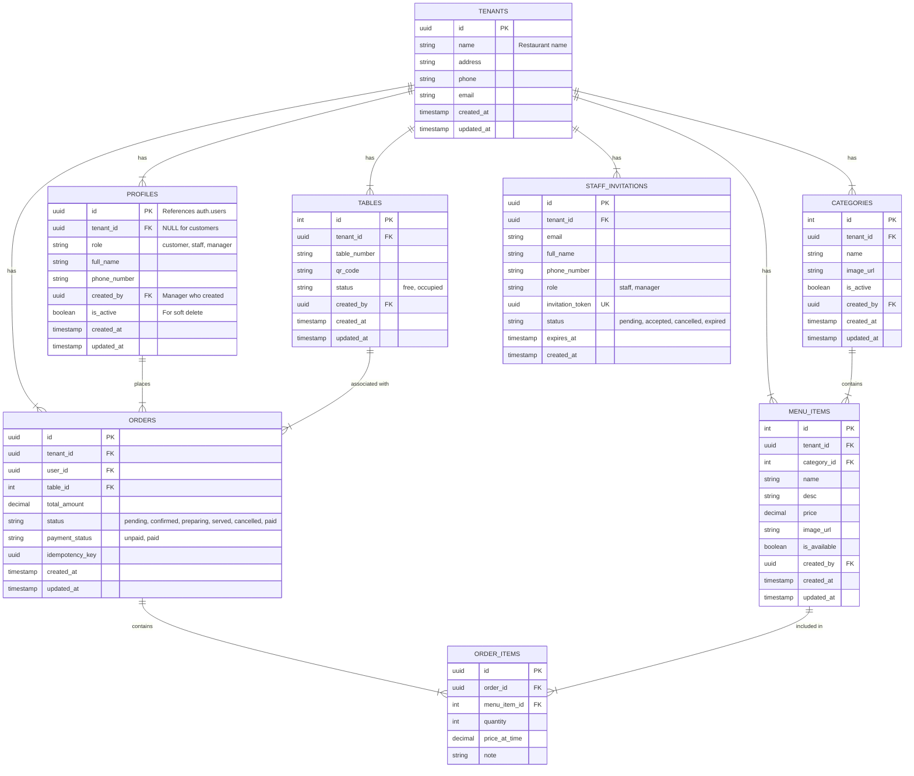

# Database Design: OneOrder System (Multi-Tenant)

## System Overview
The system uses **Supabase (PostgreSQL)** as the backend with **multi-tenant architecture**. Each restaurant is a tenant with complete data isolation via Row-Level Security (RLS).

### Applications
1. **OneOrder**: Customer facing (Menu, Cart, Orders) - identifies restaurant via QR code containing tenant_id
2. **OneOrder_SM**: Staff/Manager facing (Order Mgmt, Menu Mgmt, Staff Mgmt, Stats)

## ER Diagram

## Data Isolation Strategy

### Tenant Identification
- All business data tables include `tenant_id` column
- RLS policies automatically filter data by user's tenant
- Helper function `get_user_tenant_id()` returns current user's tenant

### Role Hierarchy
| Role | Description | Access |
|------|-------------|--------|
| `manager` | Restaurant owner/admin | Full access to tenant data, can manage staff |
| `staff` | Restaurant employee | View/update orders, tables; view menu |
| `customer` | App user | View menu, create/view own orders |

## Key Tables

### Multi-Tenant Core
- **tenants**: Restaurant information (name, address, contact)
- **staff_invitations**: Invitation-based staff onboarding

### Authentication & Profiles
- **profiles**: Extended user data with `tenant_id` for tenant association
  - `is_active`: Soft delete for staff deactivation
  - `created_by`: Tracks who created the account

### Menu System
- **categories**: Groups menu items, tenant-scoped
- **menu_items**: Food/drink items with prices, tenant-scoped

### Restaurant Operations
- **tables**: Physical tables with `table_number` identifier

### Ordering System
- **orders**: Transactions with status lifecycle
- **order_items**: Line items with price snapshot

## Row-Level Security (RLS) Policies

### Manager Access
- Full CRUD on all tenant data
- Can view/manage staff profiles

### Staff Access
- Read-only on menu items and categories
- Full access to orders and tables for operations

### Customer Access
- Read active menu items (tenant-specific via QR)
- Create and view own orders

## Helper Functions

| Function | Purpose |
|----------|---------|
| `get_user_tenant_id()` | Returns tenant_id for current user |
| `get_user_role()` | Returns role for current user |
| `is_tenant_manager(tenant_id)` | Checks if user is manager of specified tenant |
| `create_restaurant_account(...)` | Creates tenant and sets user as manager |
| `get_tenant_staff()` | Returns staff list for current tenant |
| `deactivate_staff(staff_id)` | Soft-deletes staff account |
| `create_staff_invitation(...)` | Creates invitation for new staff |
| `accept_staff_invitation(token)` | Links user to tenant via invitation |
